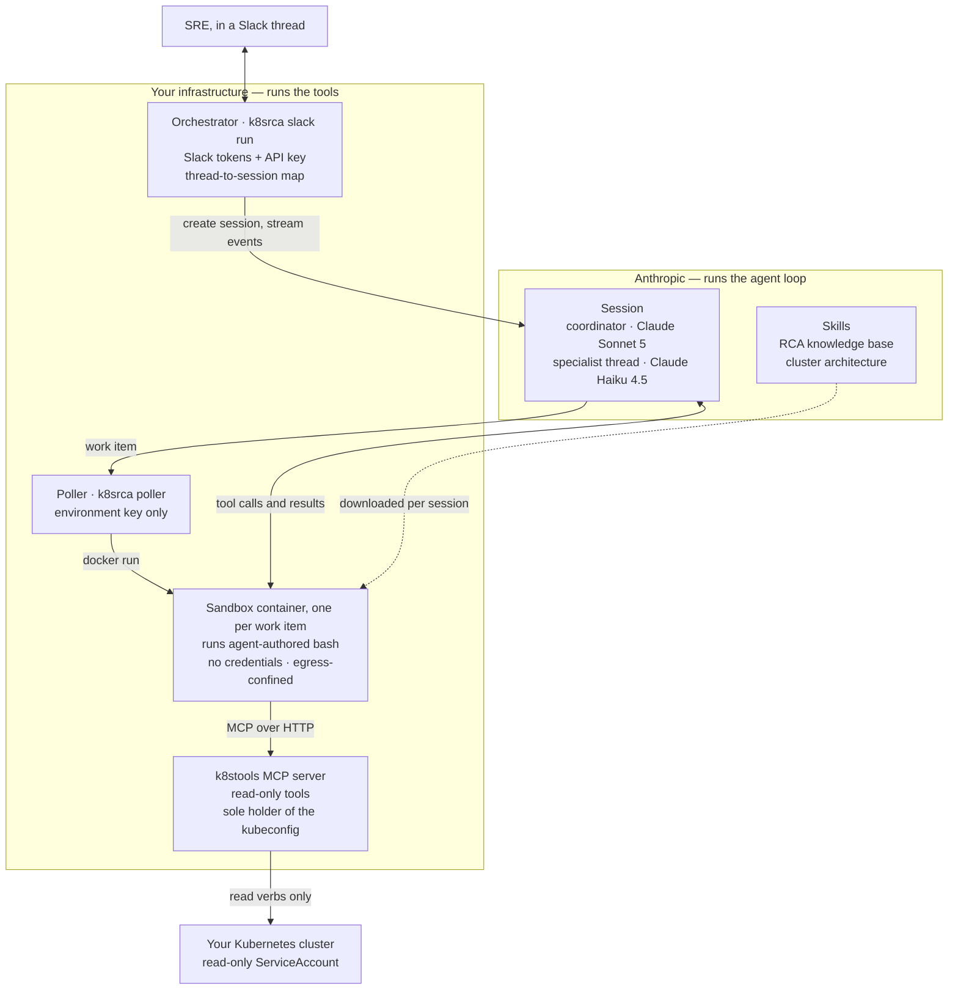

# k8srca

A Kubernetes root-cause analysis agent, built on Claude Managed Agents.

An SRE asks in Slack why a workload is failing. The agent investigates the live
cluster through read-only tools and answers with a ranked diagnosis, citing the
evidence behind every claim and saying plainly what it could not check.

**It is read-only with respect to your cluster by construction** — it observes
and recommends; it cannot apply changes. That property is structural rather than
a matter of prompting, and [§8 of the architecture design](designs/001-architecture.md)
describes the four independent layers that hold it up.

Apache 2.0 licensed. Requires Python 3.12+, Docker, and an Anthropic API key.

---

## What it looks like

Abridged from a real run against an OpenTelemetry-demo cluster:

> **@you** `@k8srca` the ad service is crash-looping, what's going on?
>
> **@k8srca** 🔍 reading container logs…
>
> **@k8srca** **The `ad` container is being killed by the kernel OOM killer
> during JVM startup.**
>
> Its memory request and limit are both `300Mi`, and no JVM heap flags are set,
> so the JVM sizes its default heap against the node's memory rather than the
> cgroup limit and is killed before it finishes starting. The container lives
> about two seconds per attempt and has restarted 1,307 times.
>
> `fraud-detection` is failing identically — same resource template, same
> missing heap flags — which points at the template rather than at either
> service's code.
>
> *One thing does not fit:* the container's `lastState.terminated.reason` is
> `Error`, not `OOMKilled`, so I have not proven the OOM killer fired. Exit code
> 137 and the two-second lifetime are consistent with it, and neither pod has
> any probe configured, so nothing else could be sending SIGKILL — but the
> label disagrees and you should know that.
>
> *Could not check:* there is no metrics backend reachable from here, so I
> cannot show the working-set trajectory that would settle it.
>
> *Suggested change (not applied):* set `-XX:MaxRAMPercentage=75` or raise the
> limit above the default heap size.

Every verifiable claim in that answer held up against `kubectl`. The discrepancy
it flagged is real — a container-runtime labelling quirk — and it was not
prompted to look for it.

---

## Why

### The problem

The first twenty minutes of a Kubernetes incident are mostly mechanical. Someone
lists pods, checks container statuses, reads events, pulls logs from the
previous instance, looks at the node, and asks whether anything was deployed
recently. It is a well-specified evidence-gathering loop, it is tedious, and it
is being done by the person least able to spare the attention.

The judgment lives in two places: what to look at next, and when to stop. An
agent is good at the loop and passable at the judgment — *if* the method is made
explicit rather than left to instinct. That is the bet this project makes, and
[design 002](designs/002-investigation-model.md) is the method.

### Read-only by construction, not by policy

The obvious next step after "diagnose this" is "now fix it," and we deliberately
do not take it.

An agent that can restart a deployment is in a different risk category from one
that can only read, and it needs a different kind of trust, review and audit.
More practically: during an incident you want a colleague who explains what they
found, not one who changes things while you are reading. So k8srca proposes
changes as text and never applies them.

The guarantee does not rest on the model choosing to behave. Four independent
layers, any one of which would hold alone:

1. **No mutating tools exist.** The MCP server the agent talks to exposes reads
   only. There is no create, patch, delete or exec to call.
2. **The sandbox holds no credentials.** The container that runs agent-authored
   code has no kubeconfig, no `kubectl`, and no cloud CLI. The credential lives
   in a different container.
3. **Egress is confined.** The sandbox can reach the tool server and Anthropic.
   It cannot reach the Kubernetes API, private address ranges, or cloud
   metadata endpoints.
4. **RBAC is the backstop.** The ServiceAccount the tool server uses is granted
   read verbs only, so even a compromise of the layers above cannot write.

### One door to the cluster

Every piece of cluster access goes through a single MCP server
([k8stools](https://github.com/BenedatLLC/k8stools), a separate open-source
project). No part of k8srca imports the Kubernetes client, shells out to
`kubectl`, or reads a kubeconfig — and that is enforced by a test that walks
every module's syntax tree, not by convention.

Three reasons, in the order they bite. One credential, one holder, so the
security property can be checked in one place. The tool surface *is* the
boundary, so code that reaches past it is not bound by it. And snapshots go
stale while tools do not — anything read at build time freezes, but the same
fact behind a tool can be asked during the investigation that needs it.

When a capability is missing, the fix is to add it to the tool server. That is
how `get_replicaset_summaries` came about: the agent needed deploy history, and
the shortcut of reading ReplicaSets directly was the wrong answer.

### A strong coordinator and a cheap specialist

A coordinator on a stronger model plans and concludes; a specialist on a cheaper
one does the high-volume reading and reports back.

The split is by **data volume, not data source.** Reading a thousand lines of
logs into the coordinator's context to find four relevant ones is how an
investigation runs out of room to think. The specialist greps and returns
findings; the coordinator keeps a handful of cheap, high-signal lookups for
itself so it need not delegate trivia. Both models are configurable per agent,
because the expense-versus-context tradeoff is a deployment decision rather than
an architectural one.

### Evidence, not confidence

The dangerous failure mode of an LLM investigator is not being wrong. It is
being *fluent* — producing a well-supported-sounding answer whose alternatives
went unmentioned. We have watched it happen: the agent retrieved three candidate
causes, discussed one, and silently dropped two, and the resulting answer read
better than an honest one would have.

So the method requires a disposition for every rival — confirmed, weakened,
refuted, or could-not-check — and treats "worth checking later" as not an
answer. Evidence is typed, so *absent* ("no errors logged") is distinguishable
from *unavailable* ("the logs are gone"). Confidence is ordinal, because a model
that emits "73%" has invented three digits it cannot justify.

### Why the plumbing looks the way it does

The cluster you want to investigate is almost certainly not reachable from the
public internet, and the tools that read it must run somewhere that can reach
it. So tool execution is **self-hosted**: Anthropic runs the agent loop, you run
the container that executes the tools.

That also keeps privileges separated between the two host processes. The
orchestrator holds the Slack tokens and an Anthropic API key but cannot claim
work items. The poller can claim work items but holds no API key — because it
spawns containers that run model-authored bash, and an API key within their
reach would be a key the agent could use.

---

## How it fits together



What happens when someone asks a question:

1. **The orchestrator** sees the mention over Slack's Socket Mode, finds or
   creates a session for that thread, and starts streaming events back into a
   single Slack message it keeps editing.
2. **Anthropic runs the agent loop** — the coordinator plans, and may spawn a
   specialist thread on a cheaper model for high-volume reads. When the agent
   calls a tool, a *work item* appears on your environment's queue.
3. **The poller** claims the work item and spawns a sandbox container for it.
   Containers are per work item, not per turn: one lives for a session's whole
   active period plus a short idle grace, so a conversation with pauses spans
   several.
4. **Inside the sandbox**, the worker acts as an MCP client to k8stools and
   serves those tools back to the agent. The skills — the RCA knowledge base and
   a generated description of your cluster's architecture — are downloaded into
   its workspace.
5. **k8stools** is the only process holding a kubeconfig. It answers with read
   verbs only.
6. **The answer** comes back through the same event stream and replaces the
   placeholder message in the Slack thread. A thread is one investigation;
   follow-ups continue it with the prior context intact.

---

## Documentation

| Guide | Covers |
| --- | --- |
| [Installation](docs/installation.md) | **Start here.** Zero to running, plus the full config reference |
| [Slack app setup](docs/slack-app-setup.md) | Creating the Slack app, scopes, events, verification |
| [Cluster setup](docs/cluster-setup.md) | Read-only ServiceAccount, minting a credential, troubleshooting |

The design documents are the reasoning behind the code, and are kept current
with it:

| Doc | Covers |
| --- | --- |
| [001 — Architecture](designs/001-architecture.md) | Platform: Managed Agents, self-hosted sandboxes, MCP wiring, Slack, security |
| [002 — Investigation model](designs/002-investigation-model.md) | How the agent reasons: hypotheses, evidence, stopping criteria |
| [003 — Operations](designs/003-operations.md) | Observability, GitOps, Kubernetes deployment |
| [004 — Scenario testing](designs/004-scenario-testing.md) | How we find out whether any of it works |

---

## Setup

What you need first: Python 3.12+ and [`uv`](https://docs.astral.sh/uv/), Docker,
an `ANTHROPIC_API_KEY`, a Slack workspace you can install an app into, and
`kubectl` access to the cluster you want to investigate.

[docs/installation.md](docs/installation.md) is the complete version. This is
the shape of it.

### 1. A least-privilege credential — do this first

```bash
kubectl apply -f rbac/k8srca-readonly.yaml   # k8srca-reader: get/list/watch, no secrets
./rbac/make-reader-kubeconfig.sh             # -> ~/.kube/k8srca-reader.yaml
```

The script mints a bound, time-limited token rather than a permanent Secret,
and prints a verification block whose `no` answers are the point:

```
  create  pods: no      delete  pods: no      patch   pods: no
  list    pods: yes     get     pods/log: yes get     secrets: no
```

`k8srca.yaml` already points `cluster_access.kubeconfig` at that path, so
there is nothing to edit unless you put it somewhere else. The credential is
configured there rather than in `.env` because `k8srca up` derives the
container-side copy from it. [docs/cluster-setup.md](docs/cluster-setup.md)
covers rotation, tunnelling to a cluster that only listens on localhost, and
the failure modes.

> **The kubeconfig you mount is the whole ballgame.** k8stools exposes no
> mutating tools and the sandbox never sees the credential, so an
> over-privileged kubeconfig is not immediately exploitable — but it removes the
> RBAC backstop that makes the read-only guarantee hold if the other layers
> fail. If you bring your own, check it:
> `kubectl auth can-i create pods -A --kubeconfig <file>` must say `no`.

### 2. Configure and bring up the local pieces

```bash
uv sync
cp .env.example .env          # Anthropic keys and Slack tokens
uv run k8srca up              # network, tunnel, kubeconfig, k8stools — idempotent
./systemd/install.sh          # units for up, tunnel, poller and orchestrator
```

The units are how the two long-running processes survive a logout or a reboot.
Without them `k8srca status` can read entirely green while the bot ignores
you — `up` starts neither the poller nor the orchestrator.

`up` is idempotent and doubles as a diagnostic. It derives what it can at run
time — Docker gateway address, TLS server name, uid — so the only site-specific
configuration is the cluster access block in `k8srca.yaml`.

### 3. Confine the sandbox's egress

```bash
sudo ./docker/egress-rules.sh apply    # needs root; `up` reports if it is missing
./docker/verify-egress.sh              # confirms the sandbox cannot reach the API server
```

### 4. Build the knowledge, provision the agents

```bash
uv run k8srca kb build        # normalize the RCA knowledge base into a skill
uv run k8srca arch build      # describe your cluster: live state, charts, docs
uv run k8srca sync --dry-run  # resolve tool routing, make no writes
uv run k8srca sync            # create or update the environment and agents
```

`sync` is idempotent: it creates on the first run and updates in place after,
producing a new agent version whenever something changes. Sessions pin their
version at creation, so in-flight investigations are unaffected. Resolved IDs
land in `.k8srca/state.json`, which is gitignored because it is
per-deployment.

### 5. Run it

```bash
uv run k8srca sandbox build   # image tagged with the commit it was built from

# terminal 1 — tool execution
uv run k8srca poller          # one sandbox container per work item

# terminal 2 — Slack
uv run k8srca slack run
```

Then `/invite @k8srca` into a channel and mention it. A Slack thread is one
investigation; follow-ups in that thread continue it. Set
`SLACK_ALLOWED_CHANNELS` so it only answers where you expect.

Useful while things are settling:

```bash
uv run k8srca status          # is a Slack mention going to be answered?
uv run k8srca slack check     # token, scopes, channel, event delivery
uv run k8srca sandbox show    # which image will a new session pin?
uv run k8srca timing          # where the last session's wall clock went
uv run k8srca down            # stop what `up` started
```

You can also drive a session without Slack:

```bash
uv run k8srca session "why is payment-api crash-looping in prod?"
uv run k8srca session --resume <id> "what changed recently?"
```

---

## Development

**No cluster is needed.** k8stools has a mock mode that serves realistic static
data, which is enough for everything except cluster-specific reasoning.

```bash
uv sync --extra dev

# A mock MCP server — no cluster, no kubeconfig
docker compose -f docker/compose.yaml --profile mock up -d k8stools-mock
sed -i 's|http://k8stools:8000/mcp|http://127.0.0.1:8009/mcp|' k8srca.yaml

uv run k8srca kb build        # normalize the KB into the skill bundle
uv run k8srca tools list      # the tool surface as the model will see it
uv run k8srca tools validate  # schema legality, collisions, per-agent routing
uv run pytest                 # unit tests — hermetic, no credentials, no cluster
```

`tools validate` runs the same checks `sync` does without touching the Anthropic
API: schema legality, cross-server name collisions, and whether each agent's
tool groups resolve.

### Testing

`uv run pytest` is hermetic and needs nothing. Two suites are opt-in because
they are not:

```bash
# against a live MCP server
K8SRCA_TEST_MCP_URL=http://127.0.0.1:8009/mcp uv run pytest tests/test_live_mcp.py

# end to end: real sessions, real containers, real money
# needs `k8srca up`, `k8srca sync`, and `k8srca poller` running
K8SRCA_TEST_LIVE=1 uv run pytest tests/test_e2e_slack.py -v -s
```

Concurrency is the part of this system that has broken most often — the poller
serialising container spawns, two Slack threads sharing a session — and none of
it shows up in a single-threaded test. Those regression tests are written so
that reverting the fix fails them; please keep them that way rather than
relaxing them into smoke tests.

### A note on `k8srca worker`

`k8srca worker` runs the worker in-process on your host rather than in a
container. It is the development shape and it is **not isolated**: it executes
agent-authored bash directly on your machine with your filesystem access.
Credentials are scrubbed from its environment, but that is defence in depth, not
a sandbox. Use `k8srca poller` against anything real.

---

## Status

v1 is complete and running against a real OpenTelemetry-demo cluster through the
containerised path. Both high-risk architectural assumptions are proven against
the live platform: the worker serves a private MCP server's tools as custom
tools, and a subagent thread's tool calls reach that same worker. All four
layers of the read-only guarantee are verified by measurement, including egress
confinement.

- [x] RBAC manifest, k8stools container, compose
- [x] Config schema, MCP tool declaration generation, manifest hashing
- [x] Worker-side tool wrapper (prefixed name → unprefixed remote call)
- [x] `k8srca sync` — agent and environment provisioning
- [x] Worker plus `k8srca session` — the two architectural risks retired
- [x] Sandbox image, spawn script, `k8srca poller` — containerised, multi-turn
- [x] Egress rules, applied and verified against a real cluster
- [x] Knowledge base, skills, system prompts
- [x] Slack orchestrator, session map, concurrent threads
- [x] Cluster architecture skill — live state, chart repositories, runbooks
- [ ] Scenario suite ([004](designs/004-scenario-testing.md)) — designed; unblocked by capture/replay in k8stools 2.0
- [ ] Durable investigation record (002 L2) — prerequisite for deploying to Kubernetes
- [ ] Alert-driven investigations, cross-session memory

---

## License

Apache 2.0 — see [LICENSE](LICENSE).
