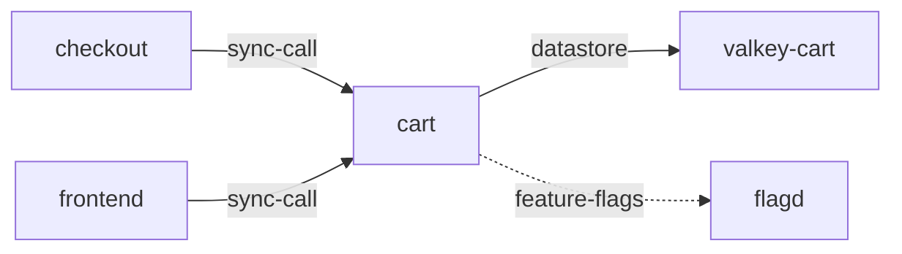

# dkgg — deployment knowledge graph generator

**Status:** draft, 2026-10-04. Nothing in this document is built yet. It
replaces the design of the `cluster-architecture` skill in k8srca's
[001 §5.2](../../../designs/001-architecture.md), and is the first standalone
component of [005](../../../designs/005-modular-architecture.md).

dkgg builds a **knowledge graph of a deployment**: what each component is, how
the components connect and in what way, and what a failure of one means for
the others. It writes it as a small wiki of linked Markdown pages that any LLM
agent can read. It does **not** record the deployment's current state; an agent
asks for that live.

---

## 1. Why

### 1.1 What the current skill gets wrong

k8srca's `cluster-architecture` skill (001 §5.2) is mostly a **snapshot of
observed state**: each workload's image, replicas, readiness, probes and
resources, frozen at build time. That is the wrong half to put in a skill:

- **k8stools answers it live.** An agent investigating an incident can read the
  current state during the investigation that needs it. k8srca's own rule says
  so: "Snapshots go stale; tools do not" (CLAUDE.md).
- **Frozen state misleads.** A scenario capture showed `ad` with
  `ready_replicas: 0`, an instant in a crash loop, which an agent could read as
  a property of the service.
- **It forces pinning.** Because the skill is a second read of the cluster, every
  k8srca scenario must pin it to the instant of its capture (004 §6.1).

Meanwhile the part only a skill can supply is the part it does worst: what
each component is *for*, how components relate (a datastore, a queue, a
feature-flag service callers can do without), and what a failure means for the
rest of the system. Today those come from free-text notes attached to a fact
database. The one time those notes were hand-written, one of them was false
and five of six scenario runs repeated it.

### 1.2 What it should be instead

A **wiki** in the sense of Karpathy's "LLM wiki": a persistent, compiled
artifact of linked pages, read through an index, where "the cross-references
are already there" and synthesis happens once, ahead of time, not on every
query. In the format of [archagent](https://github.com/BenedatLLC/archagent):
plain Markdown with a small number of machine-readable fields, hot pages that
are always read and cold pages read on demand, and typed `Connects:` edges.

### 1.3 Why standalone

The generator is useful outside k8srca: any team running an agent against a
Kubernetes deployment, or none at all, could use a knowledge graph of it. And
the best feedback on whether it works will come from deployments we cannot see.
So it is a separate package (§9), runnable without k8srca, with a way for its
users to report how it did without sending us their system (§7.3).

---

## 2. Principles

1. **Knowledge, not state.** dkgg writes what is true of the deployment as
   designed and declared: components, kinds, connections, purposes, failure
   impact, declared configuration. Anything an agent can read live through
   k8stools (replicas, readiness, current images, restarts, events) is left out.
2. **Every claim cites an input.** A page sentence that cannot be traced to a
   collected input (a doc page, a chart, an environment reference, a review
   decision) is a defect, and `check` reports it (§7). The false readiness note
   was exactly an untraceable claim.
3. **Mechanical facts are computed, not written.** The component inventory, raw
   connections and declared configuration come from deterministic code. The LLM
   writes prose and classifies, and is checked against what the code found. It
   proposes; it does not decide what exists. Diagrams are drawn
   from the same computed graph, never by the LLM (§3.6).
4. **Reviewed, and review survives regeneration.** A human reviews each build as
   a diff. A correction goes into a review file that the next build must respect
   (§5.4), so it is not lost the next time the LLM rewrites a page.
5. **Describe the system, not how to diagnose it.** Pages say what each
   component is and what a failure of it does to the others, whether derived
   from typed edges or **stated in the documentation**, which is included and
   cited. They never say how to diagnose ("check the memory limit first"):
   when k8srca's skill carried that, scenario trap scores fell from 6/6 to 2/6.
   Diagnosis has two other homes, and dkgg stays out of both:
   - **system-specific runbooks** go in a diagnostic skill built by the runbook
     generator (005 §6.1);
   - **general Kubernetes troubleshooting** goes in k8srca's `k8s-rca` skill.
6. **Cluster access only through MCP.** dkgg never imports a Kubernetes client
   or runs `kubectl`. It reads a cluster through a k8stools MCP server, so the
   credential lives there and the read-only guarantee is k8stools'. The one
   exception is k8srca's: `helm template`, offline, to render a pinned chart.
7. **Nothing secret reaches the model.** Environment values are reduced to the
   Service they name before anything leaves the machine. The LLM sees names,
   kinds, edges and documentation, never raw specs or values.
8. **Model-neutral on both sides.** The wiki works for any agent: plain
   Markdown, and a query tool needing only Python. Nothing in a page assumes a
   particular model, agent or tool-call syntax. The generator's own model calls
   go through a provider interface, Anthropic and OpenAI to start (§5.3).

---

## 3. The wiki

```
<out>/
  SKILL.md              hot   how to use the wiki, in a dozen lines
  AGENTS.md                   the same pointer, for agents that read AGENTS.md
  index.md              hot   the system on one page, with its diagram
  components/<name>.md  cold  one page per component, with its neighbourhood
  graph.json                  the typed edges and component kinds, for tools
  wiki.py                     deterministic queries over graph.json (§3.5)
  sources.md                  what this was built from, pinned, and when
  log.md                      what each build changed
  dkgg.json                   manifest: dkgg version, format, input digests
```

`SKILL.md` makes the directory an Agent Skill (its front matter is metadata
other agents ignore); `AGENTS.md` is the convention Codex and others read.
Where a runtime has no notion of skills, the directory is mounted as files and
the agent's instructions point at `index.md` (005 §4.2). Nothing in the wiki is
specific to k8srca, Claude, OpenAI, or any agent runtime.

### 3.1 `index.md` (hot)

Read first, always, so it is short:

- what the system is, in a paragraph;
- where traffic comes from, and the entry points;
- the system diagram (§3.6);
- every component in one line, grouped by **kind**, each linking its page;
- one line on how current the wiki is: built from what version, when, and a
  pointer to `sources.md`.

### 3.2 `components/<name>.md` (cold)

```markdown
# cart

**Kind:** service
**Connects:** valkey-cart via datastore; flagd via feature-flags (soft)
**Called by:** checkout via sync-call; frontend via sync-call
**Sources:** [docs: cart/index.md@d503571]; [chart: opentelemetry-demo 0.40.7]



## Purpose
Maintains the items users place in their carts, held in valkey-cart for fast
access. [docs: cart/index.md@d503571]

## If it fails
checkout cannot read a cart and fails the order; frontend cannot show or update
carts. [derived: Called by]

(Where the documentation states a failure's effect, the page quotes it with
its citation: for `ad`, "pages render without an advert when it is
unavailable".)

## Declared configuration
memory limit 160Mi; no probes declared. [chart: opentelemetry-demo 0.40.7]
```

- **Kind** is one of a small fixed set: `service`, `datastore`, `queue`,
  `cache`, `feature-flags`, `gateway`, `ui`, `telemetry`, `load-generator`,
  `job`, `external`. Fixed, so tools and evals can rely on it.
- **Connects** lists typed, directed edges (§3.4). **Called by** is derived from
  the other pages' Connects and never written by hand.
- **Declared configuration** is from the pinned chart: what the deployment is
  *meant* to run, which is stable for a version, unlike observed state. An agent
  comparing it with k8stools' live answer finds drift itself, at the moment it
  matters.
- Every paragraph ends with its citations. `[derived: …]` means computed from
  the graph rather than from a document.

### 3.3 Flows (deferred)

A flow page would follow one request or event through several components: for
the OTel demo, "checkout" is frontend-proxy → frontend → checkout, which calls
cart (backed by valkey-cart), currency, payment, shipping (which calls quote)
and email, then publishes to kafka for accounting and fraud-detection. That is
how an SRE reasons about "checkout is slow".

**Not in the first version** (decided 2026-10-04). A flow is the most
interpretive page: it asserts an order and a purpose across many edges, which
citations check less well than a single component's claims. Component pages
come first and are evaluated first; flows are reconsidered after, generated
only where the documentation describes the path or the typed edges imply it
unambiguously.

### 3.4 Edges

```
<from> -> <to> via <kind> [(soft)]
```

| Edge kind | Means | Failure of the target |
|---|---|---|
| `sync-call` | a request the caller waits on (HTTP, gRPC) | the caller fails or degrades now |
| `async-event` | publishes to or consumes from a queue | consumers fall behind; publishers usually carry on |
| `datastore` | reads and writes persistent state | the caller cannot serve its function |
| `cache` | reads a cache it can fall back from | slower, not broken |
| `feature-flags` | reads configuration with defaults | usually none: defaults apply |
| `telemetry` | sends traces, metrics or logs | telemetry is lost; the request path is unaffected |
| `route` | a proxy forwarding requests on a path | that path is unreachable; the proxy serves its others |
| `load` | synthetic traffic | none on the target's callers |

`(soft)` marks an edge the caller survives without. These are the categories
k8srca's eval had to decide for its reviewed truth (routing counted, feature
flags and telemetry not) — decided once, there, to score a generator and then
discarded. Here they are the content.

**Where edges come from:**

1. **Raw edges, deterministic:** environment references that name a Service,
   from the live cluster and from the rendered chart, by the rules k8srca's
   generator already uses (address-family names; any URL whose host is a
   Service; secret-named variables skipped by whole words). These are
   candidates, with the variable each came from.
2. **Kind, by the LLM:** each raw edge classified, citing the docs or the
   variable.
3. **Review:** additions, removals and reclassifications in `review.yaml`
   (§5.4), which override both.

An edge in a page that is not a raw edge or a reviewed addition fails `check`.

### 3.5 `wiki.py`

A small, deterministic query tool over `graph.json`, shipped in the wiki for the
agent to run:

```
wiki.py blast valkey-cart     what fails, degrades or lags if this fails, and how
wiki.py path frontend kafka   how one reaches the other
wiki.py deps checkout         one hop each way, typed
wiki.py kind datastore        every component of a kind
```

**Why a tool and not the agent's own traversal:** one hop is easy for a model
reading links, but a transitive closure over thirty components is where models
are careless and code is not. **Why not live:** the edges come from environment
variables in every pod spec, so a live answer is about 25 k8stools calls plus
the parsing rules, and edges change only on a deploy. Typed edges also make
`blast` more useful than k8srca's current one: a soft feature-flag edge does not
propagate, an async edge propagates as lag rather than errors.

---

### 3.6 Diagrams

Mermaid, because it is text: humans get a rendered picture (GitHub, most
editors and documentation sites render it), and an agent gets an edge list it
can read directly (`cart -->|datastore| valkey-cart`). archagent found the same.

- **Computed, never written.** `render` draws every diagram from `graph.json`,
  so a diagram cannot disagree with the edges and needs no separate check. The
  LLM does not produce Mermaid.
- **The system diagram, in `index.md`:** every component, grouped into
  subgraphs by kind, edges labelled by kind. Soft edges (feature flags,
  telemetry) are dashed (`-.->`), so the request path stands out. For the OTel
  demo's ~30 components that is a few dozen lines, small enough for the page
  that is always read; above a size limit, the index keeps one diagram of
  request-path kinds only and links the full one.
- **A neighbourhood diagram on each component page:** the component, what it
  calls and what calls it, one hop each way.

## 4. Inputs

| Input | Provides | How |
|---|---|---|
| Live cluster (via k8stools MCP) | inventory: workloads, their kinds and owners, Services; raw edges from env | `get_*_summaries`, `get_pod_spec`, pod `owner` (k8stools ≥ 2.3.0). Structure only; no state is kept |
| Chart (pinned) | declared configuration; raw edges from declared env; declared-only components | Helm repo + chart + version, rendered offline by `helm template` (`dkgg.fetch`) |
| Docs (pinned) | purposes; what components talk to | a git repo at a commit, one path; the lead section of each page |
| `review.yaml` | corrections that survive regeneration (§5.4) | a file next to the config |
| The previous wiki | what changed (`log.md`), which pages need regenerating | the output directory |

`sources.md` records each input with its pin: chart version, docs commit,
k8stools version, build time, and the deployed version the inputs describe.

**Live-cluster access is structural.** dkgg reads the cluster to learn what
exists and how it is wired, which changes on a deploy, not to record how it is
doing. A cluster is optional: a chart and docs alone produce a wiki of the
declared system, flagged as such in `index.md`.

---

## 5. Building

### 5.1 Four stages

1. **Collect** (deterministic): inventory, declared configuration and raw edges
   from the inputs, into one structured model. This is k8srca's current
   collector code, minus everything that records observed state.
2. **Synthesize** (LLM): from the model and the doc leads, write each component
   page, classify every raw edge, and write `index.md`. Every
   sentence carries citations. The model sees names, kinds, edges, declared
   configuration and documentation text: never a raw pod spec or env value
   (principle 7).
3. **Verify** (deterministic, plus an optional judge): §7.1's checks. A build
   that fails them is written but marked failing, and k8srca will not sync it.
4. **Render** `graph.json`, the diagrams (§3.6) and the derived sections
   (Called by, If it fails where derived), write `log.md`, and diff against the
   previous build.

### 5.2 Incremental and bounded

*As built (step 3): one synthesis call per system, cached by input digest; a
change anywhere re-synthesises everything. Per-page regeneration below is
deferred until a system large enough to need it.*

Each page records a digest of the inputs it was written from. A rebuild
regenerates only pages whose inputs changed, so an unchanged deployment costs
nothing and a one-service deploy costs one page. A full first build of the OTel
demo (about 30 components) is expected to cost well under a dollar; the
estimate is printed before the synthesis stage runs, and `--max-usd` stops it.

### 5.3 Model providers

Synthesis and the judge call a model through a small interface:

```python
class Provider(Protocol):
    def complete(self, system: str, prompt: str, schema: dict) -> tuple[dict, Usage]: ...
```

with adapters for Anthropic and OpenAI. Prompts are written provider-neutrally,
and structured output is requested with a JSON Schema both APIs accept. The
config's `model:` (`claude-opus-5`, or `openai:<model>`) selects one;
standalone users bring their own key. Usage is reported in tokens and dollars,
so `--max-usd` works for either.

A second provider is a requirement for evaluation as much as for users: the
same inputs synthesised by two providers and scored by the same `dkgg eval`
is how we learn whether a page's quality is the generator's or one model's.

### 5.4 Review

The wiki is generated, not committed (decided 2026-10-04): in k8srca it is
written to a gitignored directory, as the skill is today. What is committed is
what a person decided: `review.yaml` and the config that pins the inputs.

So review cannot be a git diff of the wiki. Each build keeps the previous one
beside it, `log.md` summarises what changed, and `dkgg diff` shows it page by
page. The reviewer reads the changed pages and records corrections and sign-off
in `review.yaml`.

A correction is not an edit to a page, which the next build would overwrite.
It goes in `review.yaml`:

```yaml
edges:
  add:    [{from: product-catalog, to: postgresql, kind: datastore}]
  remove: [{from: frontend, to: kubernetes}]
  kind:   [{from: cart, to: flagd, kind: feature-flags, soft: true}]
components:
  flagd: {kind: feature-flags}
claims:
  - page: ad
    reject: "never reaches readiness"
    why: "no readiness probe is declared; it is ready as soon as it runs"
reviewed: {by: jfischer, on: 2026-10-04}
```

Synthesis receives `review.yaml` and must respect it; `check` fails a page
that reintroduces a rejected claim or contradicts a reviewed edge.

---

## 6. Running it

### 6.1 Standalone

```bash
uvx dkgg build --config dkgg.yaml          # or flags, for a first try
uvx dkgg check [--judge] [--share]
uvx dkgg demo                              # a shipped capture, no cluster needed
```

```yaml
# dkgg.yaml
cluster:
  mcp: http://localhost:8000/mcp       # a running k8stools server
  # or: launch: {kubeconfig: ~/.kube/config}   starts k8stools locally (stdio)
  namespaces: [default]                # or --namespace, repeatable
chart:
  helm: {repo: https://open-telemetry.github.io/opentelemetry-helm-charts,
         chart: opentelemetry-demo, version: 0.40.7, release: my-otel-demo}
docs:
  git: {repo: https://github.com/open-telemetry/opentelemetry.io,
        ref: d503571bbd711e05b9e6f85966fed6f0e00ba910,
        path: content/en/docs/demo/services}
model: claude-opus-5                   # or openai:<model>
review: review.yaml
out: ./wiki
```

- **Cluster access stays in k8stools** either way. `launch` starts k8stools as a
  subprocess and passes it the kubeconfig; dkgg's own code never reads it.
- **One wiki per system.** A system is what the config describes. In a large
  cluster where only part of it is the system of interest, `--namespace`
  (repeatable) narrows it; the default is every namespace k8stools can see,
  minus system namespaces (`kube-*`).
- **`demo`** replays a shipped k8stools capture (`k8s-mcp-server
  --state-file`) with the OTel demo's chart and docs, so someone can see a wiki
  in a minute without a cluster or an API key for the collect stage.

### 6.2 Inside k8srca

k8srca's `architecture:` configuration becomes a `dkgg:` section of the same
shape, and `k8srca arch build` calls dkgg through a thin adapter that fits it to
k8srca's generator contract (005 §6.2). `k8srca sync` uploads the wiki as the
`cluster-architecture` skill. Scenario recording pins the wiki by **deployed
version** rather than by capture instant, since it no longer holds state (§8).

---

## 7. Checking and evaluation

### 7.1 `dkgg check` — no answer key needed

Run after every build, by anyone:

| Check | Fails when |
|---|---|
| inventory | a live or declared workload has no page, or a page has no workload |
| citations | a sentence has no citation, or cites an input that does not exist |
| edges | a page edge is neither a raw edge nor a reviewed addition; a raw edge is unclassified |
| links | a link points at no page |
| review | a page reintroduces a rejected claim or contradicts a reviewed edge |
| guidance | a page gives diagnostic advice (a short fixed pattern list, plus the judge) |
| consistency (`--judge`) | a page claim is contradicted by the inputs: k8srca's docs judge, extended to the generated text. Paid, opt-in |

### 7.2 `dkgg eval` — with an answer key

k8srca's current eval (`k8srca eval arch`) moves here, generalised to the wiki:
inventory completeness, **typed** edge recall and precision against a reviewed
truth (now including whether each edge's kind is right), declared-configuration
accuracy against the chart, and the judge. k8srca keeps its two cases (our OTel
demo install and ITBench-Lite's) as fixtures, and its reviewed dependency truth
becomes their typed-edge truth.

### 7.3 Feedback from deployments we cannot see

`dkgg check --share` prints a summary with counts and categories, not names:
components by kind, edges by kind and how many were unclassified or rejected,
citation coverage, check failures by type, judge findings by type, build cost,
and the input kinds used. It is meant to be pasted into a GitHub issue. It is
how we learn where dkgg fails on systems we cannot access, and the template for
the issue asks for it.

---

## 8. What changes in k8srca

- **001 §5.2** points here for the skill's design; its fact database and
  `arch_query.py` are retired.
- **The skill's `SKILL.md`** becomes dkgg's: read `index.md`, use `wiki.py`,
  get state from k8stools. The current text still describes hand-written notes
  that no longer exist.
- **004's pinning gets simpler.** A wiki without state does not have to describe
  the instant of a capture, only the deployed version. Scenarios stop rebuilding
  it at record time.
- **Measured before it is adopted.** The skill is agent instructions, so the
  switch runs `jvm-oom-on-startup` n=6 on the old skill and the new, and keeps
  the new one only if no dimension is worse.
- **The `k8s-rca` knowledge base stays in k8srca.** It is generic Kubernetes
  knowledge, not a description of a deployment, and has little use without
  k8srca's agent.

---

## 9. Package and boundary

```
packages/dkgg/
  pyproject.toml          name "dkgg", its own version, published to PyPI
  README.md
  docs/design.md          this document
  src/dkgg/
    collect/              inventory, charts, docs, edges, fetch (from k8srca arch/)
    synthesize.py         the LLM stage
    verify.py             §7.1
    render.py             pages, graph.json, wiki.py, log.md
    eval.py               §7.2 (from k8srca evals/architecture.py)
    mcp.py                the MCP client it needs, its own
    cli.py
  tests/
```

- **A uv workspace member.** k8srca depends on it by path, so one checkout, one
  test run, and one commit can change both. Our development flow does not
  change.
- **It never imports k8srca.** A test walks dkgg's AST and fails on any
  `k8srca` import, as k8srca's cluster-access test does for the Kubernetes
  client. What dkgg needs from k8srca today moves *into* dkgg, and k8srca
  imports it from there: the architecture source models (`ArchSource`,
  `HelmChartRef`, `GitRef`), the MCP connection, and the tool-call wrapper.
  k8srca's generator contract stays in k8srca; the adapter (§6.2) bridges.
- **Its own rules, enforced by its own tests:** cluster access only through MCP
  (with the `helm template` exception), and nothing secret to the model.
- **Versioned and released on its own,** an exception to 005's "in-repo
  components ship as one release", because it is meant for outside users.
- **It may never need its own repository.** If outside contributors arrive and
  want their own tracker, `git subtree split` takes it with history; the
  boundary test means there is nothing to untangle.

---

## 10. Migration

Each step leaves k8srca working.

1. **Package, no behaviour change.** Create the workspace member, move k8srca's
   `arch/` and `evals/architecture.py` into it with their tests, add the
   boundary test and the adapter. Exit: `k8srca eval arch` reports the same
   scores, and the skill k8srca syncs is byte-identical.
   *Landed 2026-10-04.* Scores identical on both installs; every skill file
   identical apart from `architecture.json`'s `built_at` (and so the
   manifest's content digest). The eval's case running stays in k8srca, since
   it replays captures through k8srca's k8stools container; its scoring moved.
2. **Deterministic wiki.** Inventory, kinds where they are mechanical, declared
   configuration, raw edges, `graph.json`, `wiki.py`, and skeleton pages with no
   prose. Observed state dropped. Exit: `check` passes its deterministic rows;
   eval inventory and edge recall unchanged.
   *Landed 2026-10-04.* `dkgg build` / `dkgg check`; `k8srca eval arch` now
   scores the wiki (inventory 100%, dependency recall and precision 100% on
   both installs, declared accuracy 100% on ours, `check` clean). Choices made:
   no semantic kind is mechanical, so every component is `unclassified` until
   step 3, with the workload type (Deployment, StatefulSet, DaemonSet) recorded
   separately; the chart's env is a second, independent source of edges (on our
   install all 44 edges have both live and chart evidence); `change_history` is
   not a wiki source, since it is state; and the wiki carries no timestamp, so
   an unchanged deployment rebuilds byte-identical and only `log.md` is dated,
   when something changed. The legacy skill is still what k8srca syncs; its only
   change is that its source list now names each pinned reference (chart version,
   docs commit) alongside the cache path.
3. **Synthesis.** Pages, edge kinds, index, citations, `review.yaml`, diagrams.
   Exit: `check` passes on both eval installs; the judge finds no contradiction;
   typed-edge eval at or above a bar set from the first run.
   *Landed 2026-10-04.* `dkgg build --model claude-opus-5` (or `openai:<model>`);
   `k8srca eval arch --model` scores kinds against draft truth. The bar, from
   the run after the kind decisions (§11): on ours kind accuracy 96% and
   edge-kind accuracy 100% (42 edges scored), `check` clean, the judge finds
   no contradiction in 52 pages including the generated prose; on ITBench's
   (no docs) 90% and 97%. Every miss is a kind the inputs give no evidence
   for: opensearch has no docs page and no edge (the collector's exporter is
   configured in a ConfigMap, not env), so the model calls it a datastore
   rather than make an uncited claim; without docs, valkey-cart reads as a
   datastore and frontend as a service. These are what `review.yaml` is for;
   the eval cases deliberately have none, so the scores measure the generator.
   Cost: about $0.90 for ours (52k tokens in, 28k out), $0.53 for ITBench's.
   Choices made:
   - **One call per system, not per page** (§5.2 deferred). The model must see
     every edge to classify each consistently, and at $1 a full build the
     incremental saving is small. Instead the whole synthesis is cached by a
     digest of its inputs, model, prompt and schema
     (`<cache>/synthesis/<digest>.json`): an unchanged deployment costs
     nothing, any change re-synthesises everything.
   - **The model proposes; validation decides.** A synthesis that adds or drops
     a component or an edge, or cites an input it was not given, gets one
     repair round with its errors; one still invalid is written with its
     errors, which `check` reports as `synthesis` rows.
   - **Blast follows `soft`, not the edge kind.** A failure propagates over
     any non-soft edge except async-event, telemetry, route and load. A
     cache the caller cannot bypass (cart's Valkey) is a cache edge that is
     not soft, and takes the caller down with it.
   - **The judge reads generated prose** as well as the quoted docs, by the
     same rule.
4. **Switch k8srca.** New `SKILL.md`, scenario pinning by version, the n=6
   before/after. Exit: no scenario dimension worse.
5. **Outside users.** README, `demo`, `check --share`, issue template, PyPI
   release.

---

## 11. Open questions

Decided 2026-10-04: pages are LLM-written and reviewed; observed state is
dropped; Anthropic and OpenAI are both supported, and the wiki is
model-neutral; failure effects stated in the docs are included; runbooks and
general Kubernetes advice belong to other skills; one wiki per system,
narrowed by `--namespace`; flows deferred (§3.3); the wiki is generated into
this repository and not committed, with `review.yaml` committed (§5.4);
diagrams in Mermaid, computed from `graph.json` (§3.6).

Decided 2026-10-04 (step 3): valkey-cart is a `cache`, one its caller cannot
bypass, so the edge is a cache edge that is not soft; frontend is a `ui`;
opensearch is `telemetry` (a datastore, but one that stores telemetry). The
rule behind the last two: kind says what a component is *for* in this system,
not what technology it is.

Also decided: every frontend-proxy edge is a `route` (renamed from `ui-route`,
since image-provider serves images, not an interface). Its docs call it a
reverse proxy for the user-facing interfaces, and Envoy keeps serving its other
paths when one upstream is down, so a failure behind it is not the proxy's.
What a user loses is stated in the routed component's "If it fails" instead.

None open.
