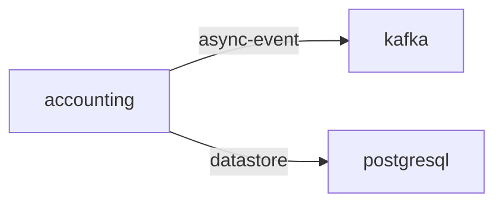

# accounting

**Kind:** service [docs: accounting.md] [chart: opentelemetry-demo-0.40.7.yaml]  
**Workload:** Deployment  
**Namespace:** default  
**Connects:** [kafka](kafka.md) via async-event; [postgresql](postgresql.md) via datastore  

## Purpose

Calculates the total amount of sold products; the calculation is mocked and received orders are printed out. [docs: accounting.md]

Once a record is retrieved from Kafka, it is saved to the database (PostgreSQL). [docs: accounting.md] [env: KAFKA_ADDR] [env: DB_CONNECTION_STRING]

## If it fails

No component calls accounting, so no request path depends on it; order records placed on Kafka are no longer consumed and saved to PostgreSQL by it. [derived: callers] [docs: accounting.md] [derived: edges]

## Connections

- **kafka** (async-event): named by `KAFKA_ADDR` (declared, opentelemetry-demo-0.40.7.yaml), `KAFKA_ADDR` (observed, k8stools)
- **postgresql** (datastore): named by `DB_CONNECTION_STRING` (declared, opentelemetry-demo-0.40.7.yaml), `DB_CONNECTION_STRING` (observed, k8stools)

## Documentation

> # Accounting Service
>
>
> This service calculates the total amount of sold products. This calculation is
> currently mocked and received orders are printed out. Once a record is retrieved
> from Kafka, it is saved to the database (PostgreSQL).
>
> [Accounting Service](https://github.com/open-telemetry/opentelemetry-demo/blob/main/src/accounting/)

[docs: accounting.md]

## Declared configuration

- image: ghcr.io/open-telemetry/demo:2.2.0-accounting [chart: opentelemetry-demo-0.40.7.yaml]
- replicas: 1 [chart: opentelemetry-demo-0.40.7.yaml]
- resources: requests memory 120Mi; limits memory 120Mi [chart: opentelemetry-demo-0.40.7.yaml]
- probes: none configured [chart: opentelemetry-demo-0.40.7.yaml]
