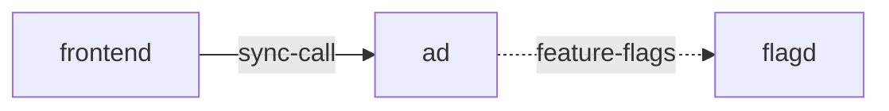

# ad

**Kind:** service [docs: ad.md] [chart: opentelemetry-demo-0.40.7.yaml]  
**Workload:** Deployment  
**Namespace:** default  
**Connects:** [flagd](flagd.md) via feature-flags (soft)  
**Called by:** [frontend](frontend.md)  

## Purpose

Determines appropriate ads to serve to users based on context keys; the ads are for products available in the store. [docs: ad.md]

Serves callers on port 8080 and reads feature flag values from flagd. [chart: opentelemetry-demo-0.40.7.yaml] [env: FLAGD_HOST]

## If it fails

The frontend, its only caller, no longer receives the ads it requests for the pages and API responses it serves. [derived: callers] [docs: ad.md]

## Connections

- **flagd** (feature-flags, soft): named by `FLAGD_HOST` (declared, opentelemetry-demo-0.40.7.yaml), `FLAGD_HOST` (observed, k8stools)

## Documentation

> # Ad Service
>
>
> This service determines appropriate ads to serve to users based on context keys.
> The ads will be for products available in the store.
>
> [Ad service source](https://github.com/open-telemetry/opentelemetry-demo/blob/main/src/ad/)

[docs: ad.md]

## Declared configuration

- image: ghcr.io/open-telemetry/demo:2.2.0-ad [chart: opentelemetry-demo-0.40.7.yaml]
- replicas: 1 [chart: opentelemetry-demo-0.40.7.yaml]
- resources: requests memory 300Mi; limits memory 300Mi [chart: opentelemetry-demo-0.40.7.yaml]
- probes: none configured [chart: opentelemetry-demo-0.40.7.yaml]
- ports: 8080 [chart: opentelemetry-demo-0.40.7.yaml]
