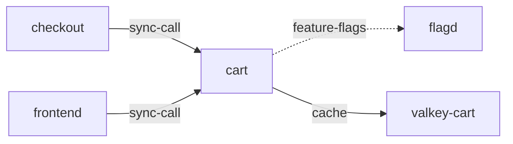

# cart

**Kind:** service [docs: cart/index.md] [chart: opentelemetry-demo-0.40.7.yaml]  
**Workload:** Deployment  
**Namespace:** default  
**Connects:** [flagd](flagd.md) via feature-flags (soft); [valkey-cart](valkey-cart.md) via cache  
**Called by:** [checkout](checkout.md), [frontend](frontend.md)  

## Purpose

Maintains items placed in the shopping cart by users. [docs: cart/index.md]

Interacts with a Valkey caching service for fast access to shopping cart data. [docs: cart/index.md] [env: VALKEY_ADDR]

## If it fails

Its callers, the frontend and checkout, can no longer read or update the items placed in a user's shopping cart. [derived: callers] [docs: cart/index.md]

## Connections

- **flagd** (feature-flags, soft): named by `FLAGD_HOST` (declared, opentelemetry-demo-0.40.7.yaml), `FLAGD_HOST` (observed, k8stools)
- **valkey-cart** (cache): named by `VALKEY_ADDR` (declared, opentelemetry-demo-0.40.7.yaml), `VALKEY_ADDR` (observed, k8stools)

## Documentation

> # Cart Service
>
>
> This service maintains items placed in the shopping cart by users. It interacts
> with a Valkey caching service for fast access to shopping cart data.
>
> [Cart service source](https://github.com/open-telemetry/opentelemetry-demo/blob/main/src/cart/)
>
> > **Note** OpenTelemetry for .NET uses the `System.Diagnostic.DiagnosticSource`
> > library as its API instead of the standard OpenTelemetry API for Traces and
> > Metrics. `Microsoft.Extensions.Logging.Abstractions` library is used for Logs.

[docs: cart/index.md]

## Declared configuration

- image: ghcr.io/open-telemetry/demo:2.2.0-cart [chart: opentelemetry-demo-0.40.7.yaml]
- replicas: 1 [chart: opentelemetry-demo-0.40.7.yaml]
- resources: requests memory 160Mi; limits memory 160Mi [chart: opentelemetry-demo-0.40.7.yaml]
- probes: none configured [chart: opentelemetry-demo-0.40.7.yaml]
- ports: 8080 [chart: opentelemetry-demo-0.40.7.yaml]
