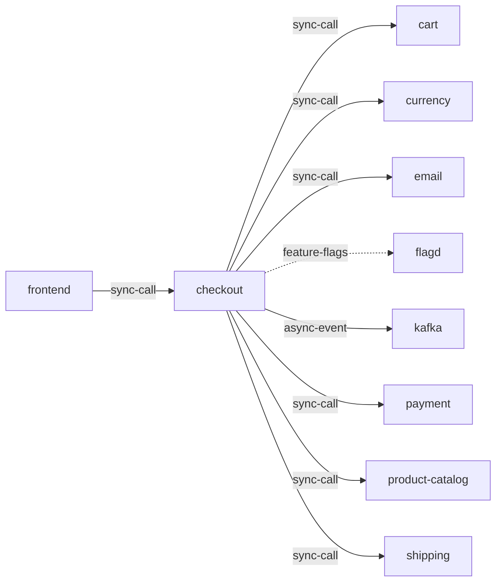

# checkout

**Kind:** service [docs: checkout.md] [chart: opentelemetry-demo-0.40.7.yaml]  
**Workload:** Deployment  
**Namespace:** default  
**Connects:** [cart](cart.md) via sync-call; [currency](currency.md) via sync-call; [email](email.md) via sync-call; [flagd](flagd.md) via feature-flags (soft); [kafka](kafka.md) via async-event; [payment](payment.md) via sync-call; [product-catalog](product-catalog.md) via sync-call; [shipping](shipping.md) via sync-call  
**Called by:** [frontend](frontend.md)  

## Purpose

Processes a checkout order from the user, calling many other services in order to process an order. [docs: checkout.md]

Retrieves the user cart, prepares the order and orchestrates the payment, shipping and the email notification. [docs: _index.md] [env: CART_ADDR] [env: PAYMENT_ADDR] [env: SHIPPING_ADDR] [env: EMAIL_ADDR]

Also calls currency and product-catalog, and publishes to Kafka. [env: CURRENCY_ADDR] [env: PRODUCT_CATALOG_ADDR] [env: KAFKA_ADDR] [derived: edges]

## If it fails

The frontend, its only caller, cannot complete order placement for users. [derived: callers] [docs: checkout.md]

Nothing is published to Kafka by it, so the queue's consumers receive no order records. [derived: edges] [env: KAFKA_ADDR]

## Connections

- **cart** (sync-call): named by `CART_ADDR` (declared, opentelemetry-demo-0.40.7.yaml), `CART_ADDR` (observed, k8stools)
- **currency** (sync-call): named by `CURRENCY_ADDR` (declared, opentelemetry-demo-0.40.7.yaml), `CURRENCY_ADDR` (observed, k8stools)
- **email** (sync-call): named by `EMAIL_ADDR` (declared, opentelemetry-demo-0.40.7.yaml), `EMAIL_ADDR` (observed, k8stools)
- **flagd** (feature-flags, soft): named by `FLAGD_HOST` (declared, opentelemetry-demo-0.40.7.yaml), `FLAGD_HOST` (observed, k8stools)
- **kafka** (async-event): named by `KAFKA_ADDR` (declared, opentelemetry-demo-0.40.7.yaml), `KAFKA_ADDR` (observed, k8stools)
- **payment** (sync-call): named by `PAYMENT_ADDR` (declared, opentelemetry-demo-0.40.7.yaml), `PAYMENT_ADDR` (observed, k8stools)
- **product-catalog** (sync-call): named by `PRODUCT_CATALOG_ADDR` (declared, opentelemetry-demo-0.40.7.yaml), `PRODUCT_CATALOG_ADDR` (observed, k8stools)
- **shipping** (sync-call): named by `SHIPPING_ADDR` (declared, opentelemetry-demo-0.40.7.yaml), `SHIPPING_ADDR` (observed, k8stools)

## Documentation

> # Checkout Service
>
>
> This service is responsible to process a checkout order from the user. The
> checkout service will call many other services in order to process an order.
>
> [Checkout service source](https://github.com/open-telemetry/opentelemetry-demo/blob/main/src/checkout/)

[docs: checkout.md]

## Declared configuration

- image: ghcr.io/open-telemetry/demo:2.2.0-checkout [chart: opentelemetry-demo-0.40.7.yaml]
- replicas: 1 [chart: opentelemetry-demo-0.40.7.yaml]
- resources: requests memory 20Mi; limits memory 20Mi [chart: opentelemetry-demo-0.40.7.yaml]
- probes: none configured [chart: opentelemetry-demo-0.40.7.yaml]
- ports: 8080 [chart: opentelemetry-demo-0.40.7.yaml]
