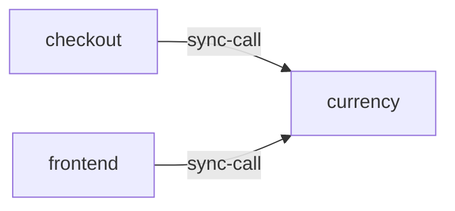

# currency

**Kind:** service [docs: currency.md] [chart: opentelemetry-demo-0.40.7.yaml]  
**Workload:** Deployment  
**Namespace:** default  
**Called by:** [checkout](checkout.md), [frontend](frontend.md)  

## Purpose

Provides functionality to convert amounts between different currencies. [docs: currency.md]

Described as the highest QPS service of the demo. [docs: _index.md]

## If it fails

Its callers, the frontend and checkout, lose currency conversion for the amounts they display and process. [derived: callers] [docs: currency.md]

## Documentation

> # Currency Service
>
>
> This service provides functionality to convert amounts between different
> currencies.
>
> [Currency service source](https://github.com/open-telemetry/opentelemetry-demo/blob/main/src/currency/)

[docs: currency.md]

## Declared configuration

- image: ghcr.io/open-telemetry/demo:2.2.0-currency [chart: opentelemetry-demo-0.40.7.yaml]
- replicas: 1 [chart: opentelemetry-demo-0.40.7.yaml]
- resources: requests memory 20Mi; limits memory 20Mi [chart: opentelemetry-demo-0.40.7.yaml]
- probes: none configured [chart: opentelemetry-demo-0.40.7.yaml]
- ports: 8080 [chart: opentelemetry-demo-0.40.7.yaml]
