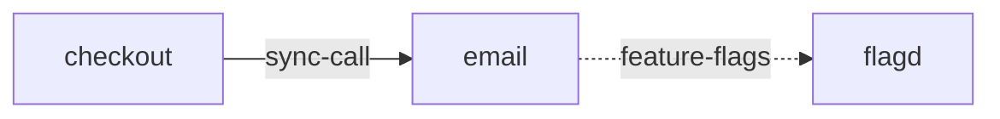

# email

**Kind:** service [docs: email.md] [chart: opentelemetry-demo-0.40.7.yaml]  
**Workload:** Deployment  
**Namespace:** default  
**Connects:** [flagd](flagd.md) via feature-flags (soft)  
**Called by:** [checkout](checkout.md)  

## Purpose

Sends a confirmation email to the user when an order is placed (mocked). [docs: email.md] [docs: _index.md]

## If it fails

Checkout, its only caller, loses the order confirmation email step. [derived: callers] [docs: email.md]

## Connections

- **flagd** (feature-flags, soft): named by `FLAGD_HOST` (declared, opentelemetry-demo-0.40.7.yaml), `FLAGD_HOST` (observed, k8stools)

## Documentation

> # Email Service
>
>
> This service will send a confirmation email to the user when an order is placed.
>
> [Email service source](https://github.com/open-telemetry/opentelemetry-demo/blob/main/src/email/)

[docs: email.md]

## Declared configuration

- image: ghcr.io/open-telemetry/demo:2.2.0-email [chart: opentelemetry-demo-0.40.7.yaml]
- replicas: 1 [chart: opentelemetry-demo-0.40.7.yaml]
- resources: requests memory 100Mi; limits memory 100Mi [chart: opentelemetry-demo-0.40.7.yaml]
- probes: none configured [chart: opentelemetry-demo-0.40.7.yaml]
- ports: 8080 [chart: opentelemetry-demo-0.40.7.yaml]
