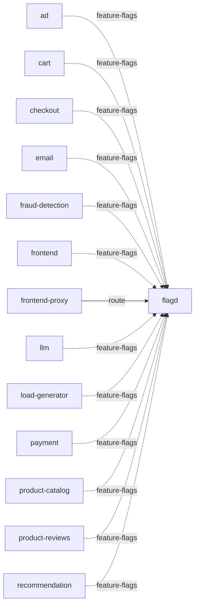

# flagd

**Kind:** feature-flags [docs: flagd-ui.md] [derived: callers]  
**Workload:** Deployment  
**Namespace:** default  
**Called by:** [ad](ad.md), [cart](cart.md), [checkout](checkout.md), [email](email.md), [fraud-detection](fraud-detection.md), [frontend](frontend.md), [frontend-proxy](frontend-proxy.md), [llm](llm.md), [load-generator](load-generator.md), [payment](payment.md), [product-catalog](product-catalog.md), [product-reviews](product-reviews.md), [recommendation](recommendation.md)  

## Purpose

Serves the demo's feature flags, which can be toggled and edited to alter the behavior of the demo environment. [docs: flagd-ui.md]

Read by most application services and by the load generator, and reached by the frontend proxy, over ports 8013, 8016 and 4000. [derived: callers] [chart: opentelemetry-demo-0.40.7.yaml]

## If it fails

Its many readers (ad, cart, checkout, email, fraud-detection, frontend, llm, load-generator, payment, product-catalog, product-reviews, recommendation) fall back to default flag behavior rather than configured flag values. [derived: callers]

Users of the frontend proxy route that reaches it lose the interface for toggling and editing feature flags, while the proxy keeps serving its other paths. [derived: callers] [docs: flagd-ui.md]

## Documentation

> # Flagd-UI Service
>
>
> This service acts as a frontend where users can toggle and edit feature flags to
> alter the behavior of the demo environment.
>
> [Flagd-UI service source](https://github.com/open-telemetry/opentelemetry-demo/blob/main/src/flagd-ui/)

[docs: flagd-ui.md]

## Declared configuration

- image: ghcr.io/open-feature/flagd:v0.12.9 [chart: opentelemetry-demo-0.40.7.yaml]
- replicas: 1 [chart: opentelemetry-demo-0.40.7.yaml]
- resources: requests memory 75Mi; limits memory 75Mi [chart: opentelemetry-demo-0.40.7.yaml]
- probes: none configured [chart: opentelemetry-demo-0.40.7.yaml]
- ports: 8013, 8016, 4000 [chart: opentelemetry-demo-0.40.7.yaml]
