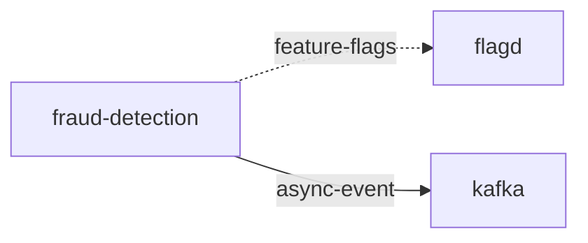

# fraud-detection

**Kind:** service [docs: fraud-detection.md] [chart: opentelemetry-demo-0.40.7.yaml]  
**Workload:** Deployment  
**Namespace:** default  
**Connects:** [flagd](flagd.md) via feature-flags (soft); [kafka](kafka.md) via async-event  

## Purpose

Analyses incoming orders and detects malicious customers; this is only mocked and received orders are printed out. [docs: fraud-detection.md]

Consumes those orders from Kafka and reads feature flags from flagd. [env: KAFKA_ADDR] [env: FLAGD_HOST] [derived: edges]

## If it fails

No component calls it, so no request path depends on it; orders on the Kafka queue are no longer analysed by it. [derived: callers] [env: KAFKA_ADDR] [docs: fraud-detection.md]

## Connections

- **flagd** (feature-flags, soft): named by `FLAGD_HOST` (declared, opentelemetry-demo-0.40.7.yaml), `FLAGD_HOST` (observed, k8stools)
- **kafka** (async-event): named by `KAFKA_ADDR` (declared, opentelemetry-demo-0.40.7.yaml), `KAFKA_ADDR` (observed, k8stools)

## Documentation

> # Fraud Detection Service
>
>
> This service analyses incoming orders and detects malicious customers. This is
> only mocked and received orders are printed out.
>
> [Fraud Detection service source](https://github.com/open-telemetry/opentelemetry-demo/blob/main/src/fraud-detection/)

[docs: fraud-detection.md]

## Declared configuration

- image: ghcr.io/open-telemetry/demo:2.2.0-fraud-detection [chart: opentelemetry-demo-0.40.7.yaml]
- replicas: 1 [chart: opentelemetry-demo-0.40.7.yaml]
- resources: requests memory 300Mi; limits memory 300Mi [chart: opentelemetry-demo-0.40.7.yaml]
- probes: none configured [chart: opentelemetry-demo-0.40.7.yaml]
