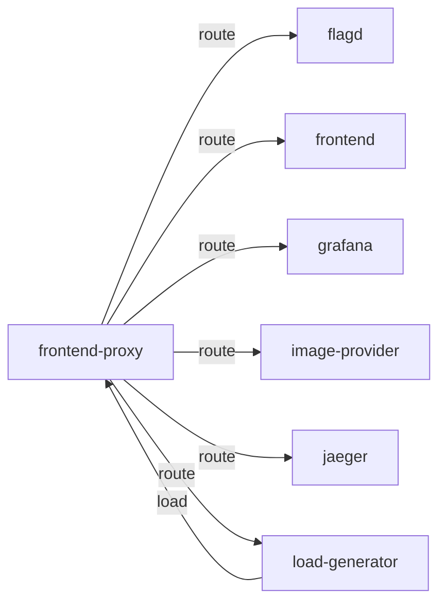

# frontend-proxy

**Kind:** gateway [docs: frontend-proxy.md]  
**Workload:** Deployment  
**Namespace:** default  
**Connects:** [flagd](flagd.md) via route; [frontend](frontend.md) via route; [grafana](grafana.md) via route; [image-provider](image-provider.md) via route; [jaeger](jaeger.md) via route; [load-generator](load-generator.md) via route  
**Called by:** [load-generator](load-generator.md)  

## Purpose

Used as a reverse proxy (Envoy) for user-facing web interfaces such as the frontend, Jaeger, Grafana, the load generator and the feature flag service. [docs: frontend-proxy.md]

Also forwards to the image provider, and listens on port 8080. [env: IMAGE_PROVIDER_HOST] [chart: opentelemetry-demo-0.40.7.yaml] [derived: edges]

## If it fails

All interfaces it fronts — frontend, Jaeger, Grafana, the load generator UI, the feature flag service and the image provider — become unreachable at their proxied paths. [docs: frontend-proxy.md] [derived: edges]

The load generator, which sends its traffic to this proxy, has no target for its simulated requests. [derived: callers]

## Connections

- **flagd** (route): named by `FLAGD_HOST` (declared, opentelemetry-demo-0.40.7.yaml), `FLAGD_UI_HOST` (declared, opentelemetry-demo-0.40.7.yaml), `FLAGD_HOST` (observed, k8stools), `FLAGD_UI_HOST` (observed, k8stools)
- **frontend** (route): named by `FRONTEND_HOST` (declared, opentelemetry-demo-0.40.7.yaml), `FRONTEND_HOST` (observed, k8stools)
- **grafana** (route): named by `GRAFANA_HOST` (declared, opentelemetry-demo-0.40.7.yaml), `GRAFANA_HOST` (observed, k8stools)
- **image-provider** (route): named by `IMAGE_PROVIDER_HOST` (declared, opentelemetry-demo-0.40.7.yaml), `IMAGE_PROVIDER_HOST` (observed, k8stools)
- **jaeger** (route): named by `JAEGER_HOST` (declared, opentelemetry-demo-0.40.7.yaml), `JAEGER_HOST` (observed, k8stools)
- **load-generator** (route): named by `LOCUST_WEB_HOST` (declared, opentelemetry-demo-0.40.7.yaml), `LOCUST_WEB_HOST` (observed, k8stools)

## Documentation

> # Frontend Proxy (Envoy)
>
>
> The frontend proxy is used as a reverse proxy for user-facing web interfaces
> such as the frontend, Jaeger, Grafana, load generator, and feature flag service.
>
> [Frontend proxy configuration source](https://github.com/open-telemetry/opentelemetry-demo/blob/main/src/frontend-proxy/)

[docs: frontend-proxy.md]

## Declared configuration

- image: ghcr.io/open-telemetry/demo:2.2.0-frontend-proxy [chart: opentelemetry-demo-0.40.7.yaml]
- replicas: 1 [chart: opentelemetry-demo-0.40.7.yaml]
- resources: requests memory 65Mi; limits memory 65Mi [chart: opentelemetry-demo-0.40.7.yaml]
- probes: none configured [chart: opentelemetry-demo-0.40.7.yaml]
- ports: 8080 [chart: opentelemetry-demo-0.40.7.yaml]
