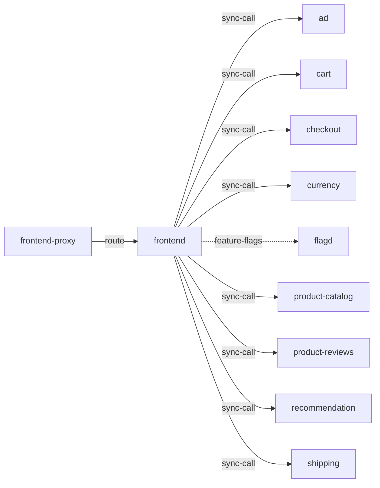

# frontend

**Kind:** ui [docs: frontend.md]  
**Workload:** Deployment  
**Namespace:** default  
**Connects:** [ad](ad.md) via sync-call; [cart](cart.md) via sync-call; [checkout](checkout.md) via sync-call; [currency](currency.md) via sync-call; [flagd](flagd.md) via feature-flags (soft); [product-catalog](product-catalog.md) via sync-call; [product-reviews](product-reviews.md) via sync-call; [recommendation](recommendation.md) via sync-call; [shipping](shipping.md) via sync-call  
**Called by:** [frontend-proxy](frontend-proxy.md)  

## Purpose

Provides a UI for users, as well as an API leveraged by the UI or other clients, based on Next.JS with a React web UI and API routes. [docs: frontend.md]

Fans out to the shop services: ad, cart, checkout, currency, product-catalog, product-reviews, recommendation and shipping. [derived: edges] [env: AD_ADDR] [env: CART_ADDR] [env: CHECKOUT_ADDR] [env: CURRENCY_ADDR] [env: PRODUCT_CATALOG_ADDR] [env: PRODUCT_REVIEWS_ADDR] [env: RECOMMENDATION_ADDR] [env: SHIPPING_ADDR]

## If it fails

Users reaching it through the frontend proxy's route lose the website and its API; the proxy continues to serve its other paths. [derived: callers] [docs: frontend.md]

The shop services it calls stop receiving traffic from this path. [derived: edges]

## Connections

- **ad** (sync-call): named by `AD_ADDR` (declared, opentelemetry-demo-0.40.7.yaml), `AD_ADDR` (observed, k8stools)
- **cart** (sync-call): named by `CART_ADDR` (declared, opentelemetry-demo-0.40.7.yaml), `CART_ADDR` (observed, k8stools)
- **checkout** (sync-call): named by `CHECKOUT_ADDR` (declared, opentelemetry-demo-0.40.7.yaml), `CHECKOUT_ADDR` (observed, k8stools)
- **currency** (sync-call): named by `CURRENCY_ADDR` (declared, opentelemetry-demo-0.40.7.yaml), `CURRENCY_ADDR` (observed, k8stools)
- **flagd** (feature-flags, soft): named by `FLAGD_HOST` (declared, opentelemetry-demo-0.40.7.yaml), `FLAGD_HOST` (observed, k8stools)
- **product-catalog** (sync-call): named by `PRODUCT_CATALOG_ADDR` (declared, opentelemetry-demo-0.40.7.yaml), `PRODUCT_CATALOG_ADDR` (observed, k8stools)
- **product-reviews** (sync-call): named by `PRODUCT_REVIEWS_ADDR` (declared, opentelemetry-demo-0.40.7.yaml), `PRODUCT_REVIEWS_ADDR` (observed, k8stools)
- **recommendation** (sync-call): named by `RECOMMENDATION_ADDR` (declared, opentelemetry-demo-0.40.7.yaml), `RECOMMENDATION_ADDR` (observed, k8stools)
- **shipping** (sync-call): named by `SHIPPING_ADDR` (declared, opentelemetry-demo-0.40.7.yaml), `SHIPPING_ADDR` (observed, k8stools)

## Documentation

> # Frontend
>
>
> The frontend is responsible to provide a UI for users, as well as an API
> leveraged by the UI or other clients. The application is based on
> [Next.JS](https://nextjs.org/) to provide a React web-based UI and API routes.
>
> [Frontend source](https://github.com/open-telemetry/opentelemetry-demo/blob/main/src/frontend/)

[docs: frontend.md]

## Declared configuration

- image: ghcr.io/open-telemetry/demo:2.2.0-frontend [chart: opentelemetry-demo-0.40.7.yaml]
- replicas: 1 [chart: opentelemetry-demo-0.40.7.yaml]
- resources: requests memory 250Mi; limits memory 250Mi [chart: opentelemetry-demo-0.40.7.yaml]
- probes: none configured [chart: opentelemetry-demo-0.40.7.yaml]
- ports: 8080 [chart: opentelemetry-demo-0.40.7.yaml]
