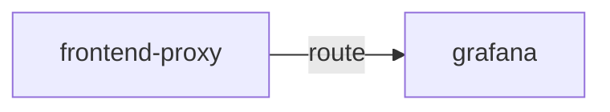

# grafana

**Kind:** ui [chart: opentelemetry-demo-0.40.7.yaml] [derived: callers]  
**Workload:** Deployment  
**Namespace:** default  
**Called by:** [frontend-proxy](frontend-proxy.md)  

## Purpose

A dashboard interface served on port 80 and reached by users through the frontend proxy. [chart: opentelemetry-demo-0.40.7.yaml] [derived: callers]

## If it fails

Users of the frontend proxy route that reaches it lose that dashboard interface; the proxy keeps serving its other paths. [derived: callers]

## Documentation

No documentation page names this component. [derived: docs source]

## Declared configuration

- image: quay.io/kiwigrid/k8s-sidecar:2.2.1 [chart: opentelemetry-demo-0.40.7.yaml]
- replicas: 1 [chart: opentelemetry-demo-0.40.7.yaml]
- resources: requests cpu 100m; memory 100Mi; limits cpu 100m; memory 100Mi [chart: opentelemetry-demo-0.40.7.yaml]
- probes: none configured [chart: opentelemetry-demo-0.40.7.yaml]
- ports: 80 [chart: opentelemetry-demo-0.40.7.yaml]
