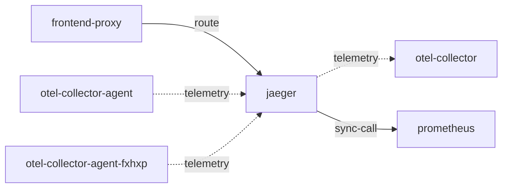

# jaeger

**Kind:** telemetry [chart: opentelemetry-demo-0.40.7.yaml] [derived: callers]  
**Workload:** Deployment  
**Namespace:** default  
**Connects:** [otel-collector](otel-collector.md) via telemetry (soft); [prometheus](prometheus.md) via sync-call  
**Called by:** [frontend-proxy](frontend-proxy.md), [otel-collector-agent](otel-collector-agent.md), [otel-collector-agent-fxhxp](otel-collector-agent-fxhxp.md)  

## Purpose

Receives trace data on OTLP, Jaeger and Zipkin ports and exposes query ports 16686 and 16685. [chart: opentelemetry-demo-0.40.7.yaml]

Is a telemetry destination of the collector agents and is reached by users through the frontend proxy. [derived: callers]

Reads metrics from Prometheus and sends its own telemetry to the collector. [env: PROMETHEUS_ADDR] [env: OTEL_COLLECTOR_HOST]

## If it fails

Users of the frontend proxy route that reaches it lose the trace viewing interface, while the proxy keeps serving the frontend and its other paths. [derived: callers]

The collector agents' trace export to it has no destination; their other exporters are unaffected by this component alone. [derived: callers]

## Connections

- **otel-collector** (telemetry, soft): named by `OTEL_COLLECTOR_HOST` (declared, opentelemetry-demo-0.40.7.yaml), `OTEL_COLLECTOR_HOST` (observed, k8stools)
- **prometheus** (sync-call): named by `PROMETHEUS_ADDR` (declared, opentelemetry-demo-0.40.7.yaml), `PROMETHEUS_ADDR` (observed, k8stools)

## Documentation

No documentation page names this component. [derived: docs source]

## Declared configuration

- image: jaegertracing/jaeger:2.14.1 [chart: opentelemetry-demo-0.40.7.yaml]
- replicas: 1 [chart: opentelemetry-demo-0.40.7.yaml]
- resources: requests memory 600Mi; limits memory 600Mi [chart: opentelemetry-demo-0.40.7.yaml]
- probes: liveness_probe, readiness_probe [chart: opentelemetry-demo-0.40.7.yaml]
- ports: 5775, 5778, 6831, 6832, 9411, 14250, 14267, 14268, 4317, 4318, 16686, 16685 [chart: opentelemetry-demo-0.40.7.yaml]
