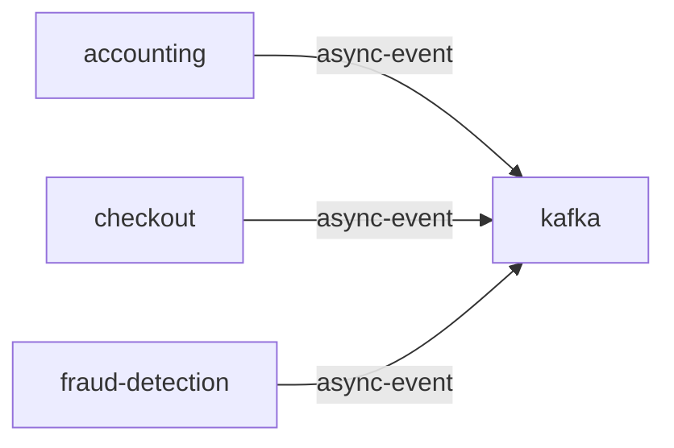

# kafka

**Kind:** queue [docs: kafka.md]  
**Workload:** Deployment  
**Namespace:** default  
**Called by:** [accounting](accounting.md), [checkout](checkout.md), [fraud-detection](fraud-detection.md)  

## Purpose

Used as a message queue service to connect the checkout service with the accounting and fraud detection services. [docs: kafka.md]

Listens on ports 9092 and 9093. [chart: opentelemetry-demo-0.40.7.yaml]

## If it fails

Checkout cannot publish order records, and accounting and fraud-detection, its other users, receive nothing to consume. [derived: callers] [docs: kafka.md]

## Documentation

> # Kafka
>
>
> This is used as a message queue service to connect the checkout service with the
> accounting and fraud detection services.
>
> [Kafka service source](https://github.com/open-telemetry/opentelemetry-demo/blob/main/src/kafka/)

[docs: kafka.md]

## Declared configuration

- image: ghcr.io/open-telemetry/demo:2.2.0-kafka [chart: opentelemetry-demo-0.40.7.yaml]
- replicas: 1 [chart: opentelemetry-demo-0.40.7.yaml]
- resources: requests memory 700Mi; limits memory 700Mi [chart: opentelemetry-demo-0.40.7.yaml]
- probes: none configured [chart: opentelemetry-demo-0.40.7.yaml]
- ports: 9092, 9093 [chart: opentelemetry-demo-0.40.7.yaml]
