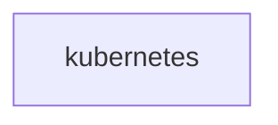

# kubernetes

**Kind:** external [derived: edges]  
**Workload:** none (a Service with no workload)  
**Namespace:** default  

## Purpose

Appears in this deployment as a component outside the application, with no declared configuration and no connections recorded to or from other components. [derived: edges] [derived: callers]

## If it fails

No component is listed as calling it, and it is listed as calling nothing, so no application request path is described as passing through it. [derived: callers] [derived: edges]

## Documentation

No documentation page names this component. [derived: docs source]
