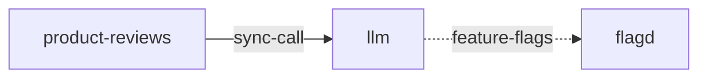

# llm

**Kind:** service [chart: opentelemetry-demo-0.40.7.yaml] [derived: callers]  
**Workload:** Deployment  
**Namespace:** default  
**Connects:** [flagd](flagd.md) via feature-flags (soft)  
**Called by:** [product-reviews](product-reviews.md)  

## Purpose

Serves requests from product-reviews, its only caller, on port 8000. [derived: callers] [chart: opentelemetry-demo-0.40.7.yaml]

Reads feature flag values from flagd. [env: FLAGD_HOST]

## If it fails

product-reviews, its only caller, loses the responses it waits on from this service. [derived: callers]

## Connections

- **flagd** (feature-flags, soft): named by `FLAGD_HOST` (declared, opentelemetry-demo-0.40.7.yaml), `FLAGD_HOST` (observed, k8stools)

## Documentation

No documentation page names this component. [derived: docs source]

## Declared configuration

- image: ghcr.io/open-telemetry/demo:2.2.0-llm [chart: opentelemetry-demo-0.40.7.yaml]
- replicas: 1 [chart: opentelemetry-demo-0.40.7.yaml]
- resources: requests None; limits None [chart: opentelemetry-demo-0.40.7.yaml]
- probes: none configured [chart: opentelemetry-demo-0.40.7.yaml]
- ports: 8000 [chart: opentelemetry-demo-0.40.7.yaml]
