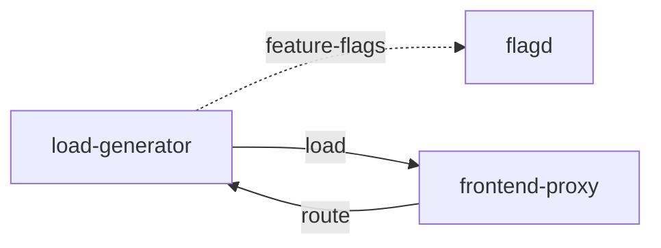

# load-generator

**Kind:** load-generator [docs: load-generator.md]  
**Workload:** Deployment  
**Namespace:** default  
**Connects:** [flagd](flagd.md) via feature-flags (soft); [frontend-proxy](frontend-proxy.md) via load  
**Called by:** [frontend-proxy](frontend-proxy.md)  

## Purpose

Based on the Python load testing framework Locust; by default it simulates users requesting several different routes from the frontend. [docs: load-generator.md]

Continuously sends requests imitating realistic user shopping flows, directing them at the frontend proxy. [docs: _index.md] [env: LOCUST_HOST]

Exposes a Locust web interface on port 8089 reached through the frontend proxy. [chart: opentelemetry-demo-0.40.7.yaml] [derived: callers]

## If it fails

The synthetic shopping traffic sent to the frontend proxy, and through it to the services behind it, stops. [derived: edges] [env: LOCUST_HOST] [docs: load-generator.md]

Users of the frontend proxy route that reaches it lose the Locust web interface, while the proxy keeps serving its other paths. [derived: callers]

## Connections

- **flagd** (feature-flags, soft): named by `FLAGD_HOST` (declared, opentelemetry-demo-0.40.7.yaml), `FLAGD_HOST` (observed, k8stools)
- **frontend-proxy** (load): named by `LOCUST_HOST` (declared, opentelemetry-demo-0.40.7.yaml), `LOCUST_HOST` (observed, k8stools)

## Documentation

> # Load Generator
>
>
> The load generator is based on the Python load testing framework
> [Locust](https://locust.io). By default it will simulate users requesting
> several different routes from the frontend.
>
> [Load generator source](https://github.com/open-telemetry/opentelemetry-demo/blob/main/src/load-generator/)

[docs: load-generator.md]

## Declared configuration

- image: ghcr.io/open-telemetry/demo:2.2.0-load-generator [chart: opentelemetry-demo-0.40.7.yaml]
- replicas: 1 [chart: opentelemetry-demo-0.40.7.yaml]
- resources: requests memory 1500Mi; limits memory 1500Mi [chart: opentelemetry-demo-0.40.7.yaml]
- probes: none configured [chart: opentelemetry-demo-0.40.7.yaml]
- ports: 8089 [chart: opentelemetry-demo-0.40.7.yaml]
