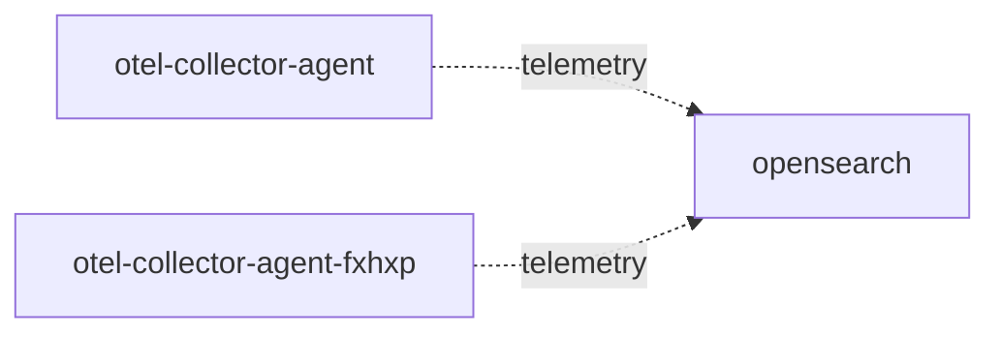

# opensearch

**Kind:** telemetry [derived: callers] [chart: opentelemetry-demo-0.40.7.yaml]  
**Workload:** StatefulSet  
**Namespace:** default  
**Also reached as:** `opensearch-headless` (headless Service)  
**Called by:** [otel-collector-agent](otel-collector-agent.md), [otel-collector-agent-fxhxp](otel-collector-agent-fxhxp.md)  

## Purpose

Receives and stores the data the OpenTelemetry Collector agents export to it. [derived: callers]

Runs as a StatefulSet exposing the OpenSearch HTTP, transport and metrics ports. [chart: opentelemetry-demo-0.40.7.yaml]

## If it fails

The collector agents' export to it has no destination; nothing else is listed as calling it. [derived: callers]

## Documentation

No documentation page names this component. [derived: docs source]

## Declared configuration

- image: opensearchproject/opensearch:3.4.0 [chart: opentelemetry-demo-0.40.7.yaml]
- replicas: 1 [chart: opentelemetry-demo-0.40.7.yaml]
- resources: requests cpu 1000m; memory 100Mi; limits memory 1100Mi [chart: opentelemetry-demo-0.40.7.yaml]
- probes: readiness_probe, startup_probe [chart: opentelemetry-demo-0.40.7.yaml]
- ports: 9200, 9300, 9600 [chart: opentelemetry-demo-0.40.7.yaml]
