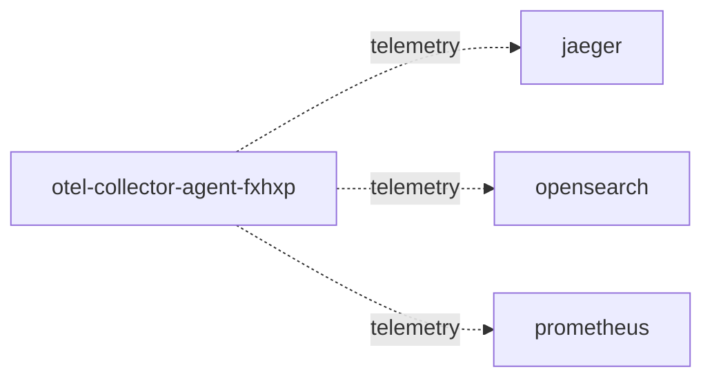

# otel-collector-agent-fxhxp

**Kind:** telemetry [config: otel-collector-agent/exporters.otlp/jaeger] [derived: edges]  
**Workload:** none (a Service with no workload)  
**Namespace:** default  
**Connects:** [jaeger](jaeger.md) via telemetry (soft); [opensearch](opensearch.md) via telemetry (soft); [prometheus](prometheus.md) via telemetry (soft)  

## Purpose

An instance of the collector agent, exporting telemetry to Jaeger, OpenSearch and Prometheus with the agent exporter configuration. [config: otel-collector-agent/exporters.otlp/jaeger] [config: otel-collector-agent/exporters.opensearch] [config: otel-collector-agent/exporters.otlphttp/prometheus]

## If it fails

Telemetry exported by this instance no longer reaches Jaeger, OpenSearch and Prometheus; nothing calls it, so application request paths are unaffected. [derived: callers] [derived: edges]

## Connections

- **jaeger** (telemetry, soft): named by config `otel-collector-agent/exporters.otlp/jaeger` (observed, k8stools)
- **opensearch** (telemetry, soft): named by config `otel-collector-agent/exporters.opensearch` (observed, k8stools)
- **prometheus** (telemetry, soft): named by config `otel-collector-agent/exporters.otlphttp/prometheus` (observed, k8stools)

## Documentation

No documentation page names this component. [derived: docs source]
