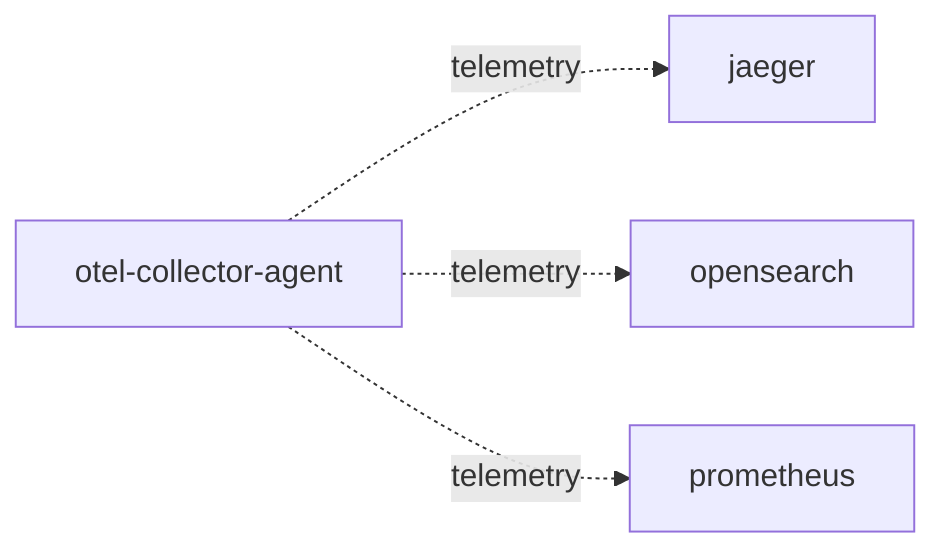

# otel-collector-agent

**Kind:** telemetry [chart: opentelemetry-demo-0.40.7.yaml] [config: otel-collector-agent/exporters.otlp/jaeger]  
**Workload:** DaemonSet  
**Namespace:** default  
**Connects:** [jaeger](jaeger.md) via telemetry (soft); [opensearch](opensearch.md) via telemetry (soft); [prometheus](prometheus.md) via telemetry (soft)  

## Purpose

Runs as a DaemonSet of OpenTelemetry Collector contrib agents that forward collected telemetry onward. [chart: opentelemetry-demo-0.40.7.yaml]

Exports to Jaeger over OTLP, to OpenSearch, and to Prometheus over OTLP/HTTP. [config: otel-collector-agent/exporters.otlp/jaeger] [config: otel-collector-agent/exporters.opensearch] [config: otel-collector-agent/exporters.otlphttp/prometheus]

## If it fails

Telemetry stops flowing from this agent to Jaeger, OpenSearch and Prometheus; nothing is listed as calling it, so request paths between application services are unaffected. [derived: callers] [derived: edges]

## Connections

- **jaeger** (telemetry, soft): named by config `otel-collector-agent/exporters.otlp/jaeger` (declared, opentelemetry-demo-0.40.7.yaml)
- **opensearch** (telemetry, soft): named by config `otel-collector-agent/exporters.opensearch` (declared, opentelemetry-demo-0.40.7.yaml)
- **prometheus** (telemetry, soft): named by config `otel-collector-agent/exporters.otlphttp/prometheus` (declared, opentelemetry-demo-0.40.7.yaml)

## Documentation

No documentation page names this component. [derived: docs source]

## Declared configuration

- image: otel/opentelemetry-collector-contrib:0.142.0 [chart: opentelemetry-demo-0.40.7.yaml]
- resources: requests memory 200Mi; limits memory 200Mi [chart: opentelemetry-demo-0.40.7.yaml]
- probes: liveness_probe, readiness_probe [chart: opentelemetry-demo-0.40.7.yaml]
