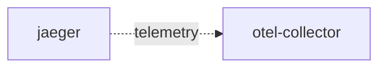

# otel-collector

**Kind:** telemetry [chart: opentelemetry-demo-0.40.7.yaml] [derived: callers]  
**Workload:** none (a Service with no workload)  
**Namespace:** default  
**Called by:** [jaeger](jaeger.md)  

## Purpose

Exposes OTLP, Jaeger and Zipkin receiver ports plus a metrics port for telemetry ingestion. [chart: opentelemetry-demo-0.40.7.yaml]

Is the telemetry endpoint configured for Jaeger. [derived: callers] [chart: opentelemetry-demo-0.40.7.yaml]

## If it fails

Jaeger, its only caller, loses the endpoint it sends telemetry to and carries on otherwise. [derived: callers]

## Documentation

No documentation page names this component. [derived: docs source]

## Declared configuration

- ports: 6831, 14250, 14268, 8888, 4317, 4318, 9411 [chart: opentelemetry-demo-0.40.7.yaml]
