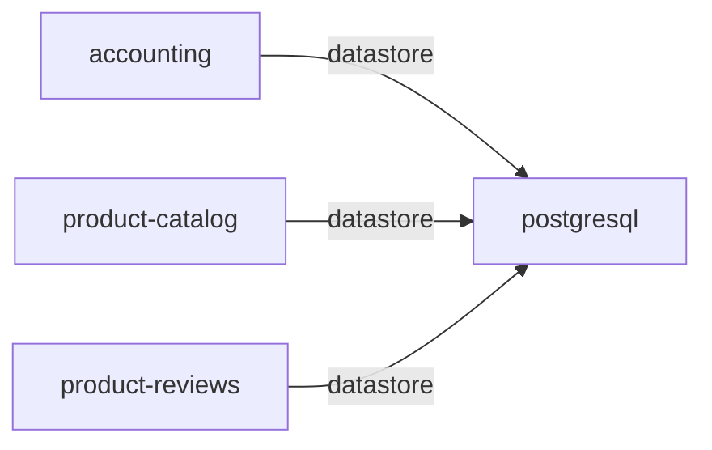

# postgresql

**Kind:** datastore [chart: opentelemetry-demo-0.40.7.yaml] [derived: callers]  
**Workload:** Deployment  
**Namespace:** default  
**Called by:** [accounting](accounting.md), [product-catalog](product-catalog.md), [product-reviews](product-reviews.md)  

## Purpose

A PostgreSQL database listening on port 5432. [chart: opentelemetry-demo-0.40.7.yaml]

Holds the persistent state read and written by accounting, product-catalog and product-reviews. [derived: callers]

## If it fails

accounting, product-catalog and product-reviews lose the persistent state they read and write. [derived: callers]

## Documentation

No documentation page names this component. [derived: docs source]

## Declared configuration

- image: postgres:17.6 [chart: opentelemetry-demo-0.40.7.yaml]
- replicas: 1 [chart: opentelemetry-demo-0.40.7.yaml]
- resources: requests memory 100Mi; limits memory 100Mi [chart: opentelemetry-demo-0.40.7.yaml]
- probes: none configured [chart: opentelemetry-demo-0.40.7.yaml]
- ports: 5432 [chart: opentelemetry-demo-0.40.7.yaml]
