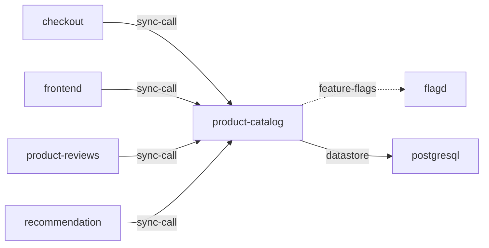

# product-catalog

**Kind:** service [docs: product-catalog.md] [chart: opentelemetry-demo-0.40.7.yaml]  
**Workload:** Deployment  
**Namespace:** default  
**Connects:** [flagd](flagd.md) via feature-flags (soft); [postgresql](postgresql.md) via datastore  
**Called by:** [checkout](checkout.md), [frontend](frontend.md), [product-reviews](product-reviews.md), [recommendation](recommendation.md)  

## Purpose

Returns information about products: all products, search for specific products, or details about any single product. [docs: product-catalog.md]

Reads feature flags from flagd and persistent state from PostgreSQL. [env: FLAGD_HOST] [env: DB_CONNECTION_STRING]

## If it fails

Its callers — frontend, checkout, recommendation and product-reviews — lose the product listings, searches and product details they request. [derived: callers] [docs: product-catalog.md]

## Connections

- **flagd** (feature-flags, soft): named by `FLAGD_HOST` (declared, opentelemetry-demo-0.40.7.yaml), `FLAGD_HOST` (observed, k8stools)
- **postgresql** (datastore): named by `DB_CONNECTION_STRING` (declared, opentelemetry-demo-0.40.7.yaml), `DB_CONNECTION_STRING` (observed, k8stools)

## Documentation

> # Product Catalog Service
>
>
> This service is responsible to return information about products. The service
> can be used to get all products, search for specific products, or return details
> about any single product.
>
> [Product Catalog service source](https://github.com/open-telemetry/opentelemetry-demo/blob/main/src/product-catalog/)

[docs: product-catalog.md]

## Declared configuration

- image: ghcr.io/open-telemetry/demo:2.2.0-product-catalog [chart: opentelemetry-demo-0.40.7.yaml]
- replicas: 1 [chart: opentelemetry-demo-0.40.7.yaml]
- resources: requests memory 20Mi; limits memory 20Mi [chart: opentelemetry-demo-0.40.7.yaml]
- probes: none configured [chart: opentelemetry-demo-0.40.7.yaml]
- ports: 8080 [chart: opentelemetry-demo-0.40.7.yaml]
