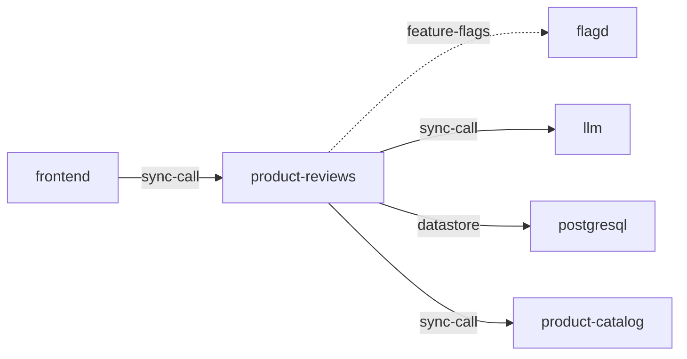

# product-reviews

**Kind:** service [docs: product-reviews.md] [chart: opentelemetry-demo-0.40.7.yaml]  
**Workload:** Deployment  
**Namespace:** default  
**Connects:** [flagd](flagd.md) via feature-flags (soft); [llm](llm.md) via sync-call; [postgresql](postgresql.md) via datastore; [product-catalog](product-catalog.md) via sync-call  
**Called by:** [frontend](frontend.md)  

## Purpose

Returns product reviews and answers questions about a specific product based on the product description and reviews. [docs: product-reviews.md]

Uses an OpenAI-compatible LLM to answer end-user questions, and the reviews are stored in PostgreSQL. [docs: product-reviews.md] [env: LLM_HOST] [env: DB_CONNECTION_STRING]

Also calls product-catalog and reads feature flags from flagd. [env: PRODUCT_CATALOG_ADDR] [env: FLAGD_HOST]

## If it fails

The frontend, its only caller, cannot show product reviews or answers to product questions. [derived: callers] [docs: product-reviews.md]

## Connections

- **flagd** (feature-flags, soft): named by `FLAGD_HOST` (declared, opentelemetry-demo-0.40.7.yaml), `FLAGD_HOST` (observed, k8stools)
- **llm** (sync-call): named by `LLM_HOST` (declared, opentelemetry-demo-0.40.7.yaml), `LLM_HOST` (observed, k8stools)
- **postgresql** (datastore): named by `DB_CONNECTION_STRING` (declared, opentelemetry-demo-0.40.7.yaml), `DB_CONNECTION_STRING` (observed, k8stools)
- **product-catalog** (sync-call): named by `PRODUCT_CATALOG_ADDR` (declared, opentelemetry-demo-0.40.7.yaml), `PRODUCT_CATALOG_ADDR` (observed, k8stools)

## Documentation

> # Product Reviews Service
>
>
> This service is responsible for returning product reviews and answering
> questions about a specific product based on the product description and reviews.
>
> It uses an OpenAI-compatible LLM to answer the end-users question about a
> specific product.
>
> The product reviews are stored in the database (PostgreSQL).
>
> [Product Reviews service source](https://github.com/open-telemetry/opentelemetry-demo/blob/main/src/product-reviews/)

[docs: product-reviews.md]

## Declared configuration

- image: ghcr.io/open-telemetry/demo:2.2.0-product-reviews [chart: opentelemetry-demo-0.40.7.yaml]
- replicas: 1 [chart: opentelemetry-demo-0.40.7.yaml]
- resources: requests memory 100Mi; limits memory 100Mi [chart: opentelemetry-demo-0.40.7.yaml]
- probes: none configured [chart: opentelemetry-demo-0.40.7.yaml]
- ports: 3551 [chart: opentelemetry-demo-0.40.7.yaml]
