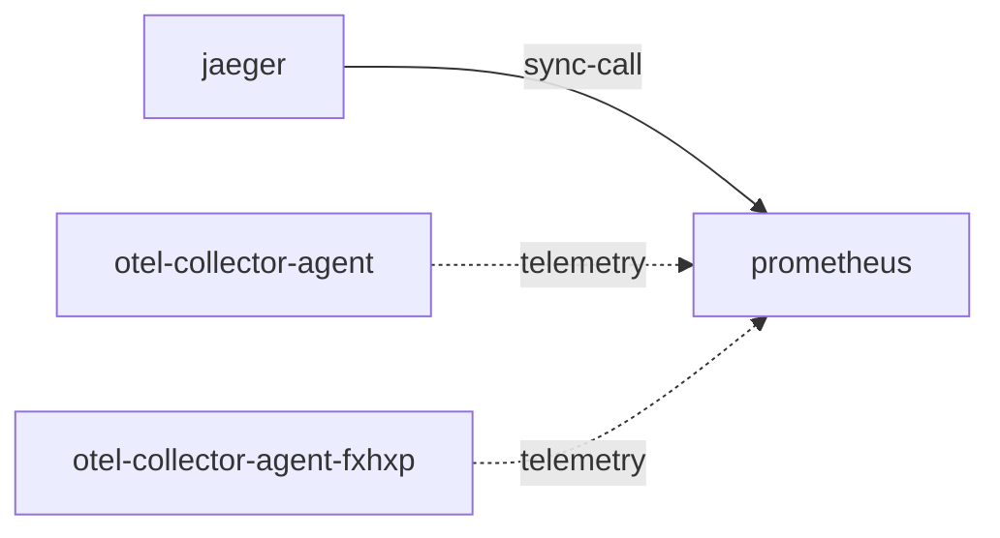

# prometheus

**Kind:** telemetry [chart: opentelemetry-demo-0.40.7.yaml] [derived: callers]  
**Workload:** Deployment  
**Namespace:** default  
**Called by:** [jaeger](jaeger.md), [otel-collector-agent](otel-collector-agent.md), [otel-collector-agent-fxhxp](otel-collector-agent-fxhxp.md)  

## Purpose

A Prometheus instance on port 9090 that stores the metrics the collector agents write to it. [chart: opentelemetry-demo-0.40.7.yaml] [derived: callers]

Is also queried by Jaeger. [derived: callers]

## If it fails

The collector agents' metric export has no destination, and Jaeger loses the metrics source it queries. [derived: callers]

## Documentation

No documentation page names this component. [derived: docs source]

## Declared configuration

- image: quay.io/prometheus/prometheus:v3.9.0 [chart: opentelemetry-demo-0.40.7.yaml]
- replicas: 1 [chart: opentelemetry-demo-0.40.7.yaml]
- resources: requests memory 400Mi; limits memory 400Mi [chart: opentelemetry-demo-0.40.7.yaml]
- probes: liveness_probe, readiness_probe [chart: opentelemetry-demo-0.40.7.yaml]
- ports: 9090 [chart: opentelemetry-demo-0.40.7.yaml]
