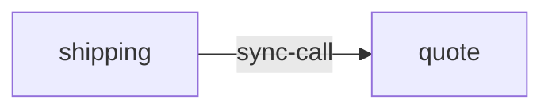

# quote

**Kind:** service [docs: quote.md] [chart: opentelemetry-demo-0.40.7.yaml]  
**Workload:** Deployment  
**Namespace:** default  
**Called by:** [shipping](shipping.md)  

## Purpose

Calculates shipping costs based on the number of items to be shipped; it is called from the Shipping Service via HTTP. [docs: quote.md]

## If it fails

Shipping, its only caller, loses the shipping cost calculation it requests over HTTP. [derived: callers] [docs: quote.md]

## Documentation

> # Quote Service
>
>
> This service is responsible for calculating shipping costs, based on the number
> of items to be shipped. The quote service is called from Shipping Service via
> HTTP.
>
> The Quote Service is implemented using the Slim framework and php-di for
> managing the Dependency Injection.
>
> The PHP instrumentation may vary when using a different framework.
>
> [Quote service source](https://github.com/open-telemetry/opentelemetry-demo/blob/main/src/quote/)

[docs: quote.md]

## Declared configuration

- image: ghcr.io/open-telemetry/demo:2.2.0-quote [chart: opentelemetry-demo-0.40.7.yaml]
- replicas: 1 [chart: opentelemetry-demo-0.40.7.yaml]
- resources: requests memory 40Mi; limits memory 40Mi [chart: opentelemetry-demo-0.40.7.yaml]
- probes: none configured [chart: opentelemetry-demo-0.40.7.yaml]
- ports: 8080 [chart: opentelemetry-demo-0.40.7.yaml]
