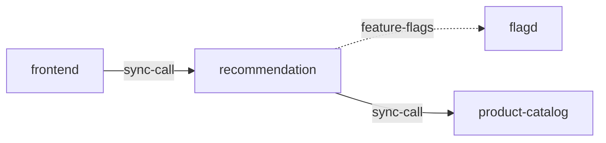

# recommendation

**Kind:** service [docs: recommendation.md] [chart: opentelemetry-demo-0.40.7.yaml]  
**Workload:** Deployment  
**Namespace:** default  
**Connects:** [flagd](flagd.md) via feature-flags (soft); [product-catalog](product-catalog.md) via sync-call  
**Called by:** [frontend](frontend.md)  

## Purpose

Returns a list of recommended products for the user based on existing product IDs the user is browsing. [docs: recommendation.md]

Calls product-catalog for product data and reads feature flags from flagd. [env: PRODUCT_CATALOG_ADDR] [env: FLAGD_HOST]

## If it fails

The frontend, its only caller, loses the product recommendations it requests. [derived: callers] [docs: recommendation.md]

## Connections

- **flagd** (feature-flags, soft): named by `FLAGD_HOST` (declared, opentelemetry-demo-0.40.7.yaml), `FLAGD_HOST` (observed, k8stools)
- **product-catalog** (sync-call): named by `PRODUCT_CATALOG_ADDR` (declared, opentelemetry-demo-0.40.7.yaml), `PRODUCT_CATALOG_ADDR` (observed, k8stools)

## Documentation

> # Recommendation Service
>
>
> This service is responsible to get a list of recommended products for the user
> based on existing product IDs the user is browsing.
>
> [Recommendation service source](https://github.com/open-telemetry/opentelemetry-demo/blob/main/src/recommendation/)

[docs: recommendation.md]

## Declared configuration

- image: ghcr.io/open-telemetry/demo:2.2.0-recommendation [chart: opentelemetry-demo-0.40.7.yaml]
- replicas: 1 [chart: opentelemetry-demo-0.40.7.yaml]
- resources: requests memory 500Mi; limits memory 500Mi [chart: opentelemetry-demo-0.40.7.yaml]
- probes: none configured [chart: opentelemetry-demo-0.40.7.yaml]
- ports: 8080 [chart: opentelemetry-demo-0.40.7.yaml]
