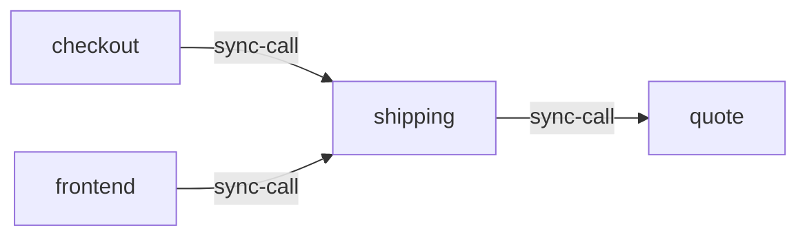

# shipping

**Kind:** service [docs: shipping.md] [chart: opentelemetry-demo-0.40.7.yaml]  
**Workload:** Deployment  
**Namespace:** default  
**Connects:** [quote](quote.md) via sync-call  
**Called by:** [checkout](checkout.md), [frontend](frontend.md)  

## Purpose

Provides shipping information including pricing and tracking information, when requested from the Checkout Service. [docs: shipping.md]

Makes quote requests to the quote service. [docs: shipping.md] [env: QUOTE_ADDR]

## If it fails

Its callers, the frontend and checkout, lose shipping pricing and tracking information. [derived: callers] [docs: shipping.md]

## Connections

- **quote** (sync-call): named by `QUOTE_ADDR` (declared, opentelemetry-demo-0.40.7.yaml), `QUOTE_ADDR` (observed, k8stools)

## Documentation

> # Shipping Service
>
>
> This service is responsible for providing shipping information including pricing
> and tracking information, when requested from Checkout Service.
>
> Shipping service is built with [Actix Web](https://actix.rs/),
> [Tracing](https://tracing.rs/) for logs and OpenTelemetry Libraries. All other
> sub-dependencies are included in `Cargo.toml`.
>
> Depending on your framework and runtime, you may consider consulting
> [Rust docs](/docs/languages/rust/) to supplement. You'll find examples of async
> and sync spans in quote requests and tracking IDs respectively.
>
> [Shipping service source](https://github.com/open-telemetry/opentelemetry-demo/blob/main/src/shipping/)

[docs: shipping.md]

## Declared configuration

- image: ghcr.io/open-telemetry/demo:2.2.0-shipping [chart: opentelemetry-demo-0.40.7.yaml]
- replicas: 1 [chart: opentelemetry-demo-0.40.7.yaml]
- resources: requests memory 20Mi; limits memory 20Mi [chart: opentelemetry-demo-0.40.7.yaml]
- probes: none configured [chart: opentelemetry-demo-0.40.7.yaml]
- ports: 8080 [chart: opentelemetry-demo-0.40.7.yaml]
