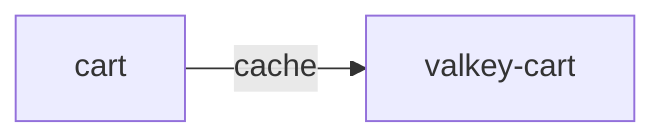

# valkey-cart

**Kind:** cache [docs: _index.md] [chart: opentelemetry-demo-0.40.7.yaml]  
**Workload:** Deployment  
**Namespace:** default  
**Called by:** [cart](cart.md)  

## Purpose

Holds the items in the user's shopping cart, which the cart service stores in Valkey and retrieves. [docs: _index.md] [derived: callers]

Runs Valkey on port 6379. [chart: opentelemetry-demo-0.40.7.yaml]

## If it fails

Cart, its only caller, loses the store of shopping cart contents it reads and writes. [derived: callers] [docs: _index.md]

## Documentation

No documentation page names this component. [derived: docs source]

## Declared configuration

- image: valkey/valkey:9.0.1-alpine3.23 [chart: opentelemetry-demo-0.40.7.yaml]
- replicas: 1 [chart: opentelemetry-demo-0.40.7.yaml]
- resources: requests memory 20Mi; limits memory 20Mi [chart: opentelemetry-demo-0.40.7.yaml]
- probes: none configured [chart: opentelemetry-demo-0.40.7.yaml]
- ports: 6379 [chart: opentelemetry-demo-0.40.7.yaml]
