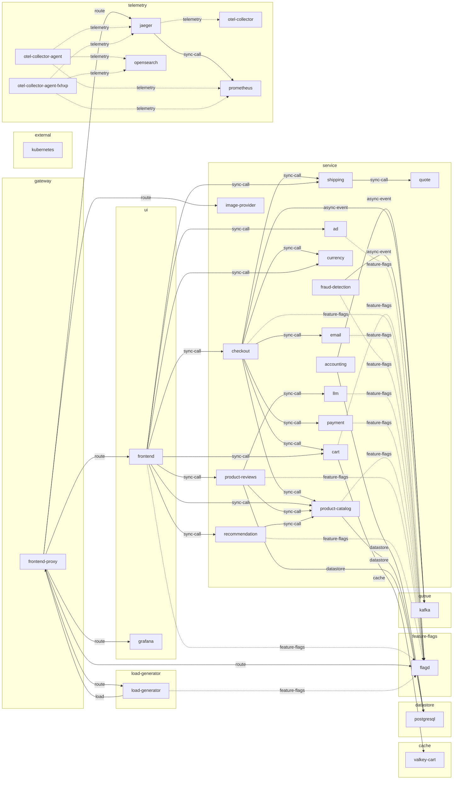

# System index

What this deployment is made of and how its parts connect. This wiki holds
no live state: for what is running now, ask the cluster.

## Overview

This is the OpenTelemetry Demo: a microservice-based online store whose services are listed in the system documentation (accounting, ad, cart, checkout, currency, email, fraud-detection, frontend, payment, product-catalog, product-reviews, quote, recommendation, shipping and supporting components). [docs: _index.md]

User-facing traffic enters through the frontend proxy, an Envoy reverse proxy for user-facing web interfaces such as the frontend, Jaeger, Grafana, the load generator and the feature flag service; the frontend itself serves the web UI and the API routes behind it. [docs: frontend-proxy.md] [docs: frontend.md] [derived: edges]

Synthetic traffic comes from the load generator, a Locust-based component that simulates users requesting several different routes from the frontend. [docs: load-generator.md] [derived: edges]

Order processing is partly asynchronous: Kafka is used as a message queue connecting the checkout service with the accounting and fraud detection services, while PostgreSQL and Valkey hold service state. [docs: kafka.md] [docs: accounting.md] [docs: cart/index.md] [derived: edges]

Telemetry from the workloads is exported by OpenTelemetry Collector agents to Jaeger, Prometheus and OpenSearch, with Jaeger and Grafana exposed through the frontend proxy. [chart: opentelemetry-demo-0.40.7.yaml] [config: otel-collector-agent/exporters.otlp/jaeger] [config: otel-collector-agent/exporters.opensearch] [config: otel-collector-agent/exporters.otlphttp/prometheus] [derived: edges]

## From the documentation

> # Services
>
>
> To visualize request flows, see the [Service Diagram](../architecture/).
>
> | Service                               | Language      | Description                                                                                                                          |
> | ------------------------------------- | ------------- | ------------------------------------------------------------------------------------------------------------------------------------ |
> | [accounting](accounting/)             | .NET          | Processes incoming orders and count the sum of all orders (mock/).                                                                   |
> | [ad](ad/)                             | Java          | Provides text ads based on given context words.                                                                                      |
> | [cart](cart/)                         | .NET          | Stores the items in the user's shopping cart in Valkey and retrieves it.                                                             |
> | [checkout](checkout/)                 | Go            | Retrieves user cart, prepares order and orchestrates the payment, shipping and the email notification.                               |
> | [currency](currency/)                 | C++           | Converts one money amount to another currency. Uses real values fetched from European Central Bank. It's the highest QPS service.    |
> | [email](email/)                       | Ruby          | Sends users an order confirmation email (mock/).                                                                                     |
> | [flagd-ui](flagd-ui/)                 | Elixir        | Allows toggling and editing of feature flags.                                                                                        |
> | [fraud-detection](fraud-detection/)   | Kotlin        | Analyzes incoming orders and detects fraud attempts (mock/).                                                                         |
> | [frontend](frontend/)                 | TypeScript    | Exposes an HTTP server to serve the website. Does not require sign up / login and generates session IDs for all users automatically. |
> | [load-generator](load-generator/)     | Python/Locust | Continuously sends requests imitating realistic user shopping flows to the frontend.                                                 |
> | [payment](payment/)                   | JavaScript    | Charges the given credit card info (mock/) with the given amount and returns a transaction ID.                                       |
> | [product-catalog](product-catalog/)   | Go            | Provides the list of products from a JSON file and ability to search products and get individual products.                           |
> | [product-reviews](product-reviews/)   | Python        | Returns product reviews and answers questions about a specific product based on the product description and reviews.                 |
> | [quote](quote/)                       | PHP           | Calculates the shipping costs, based on the number of items to be shipped.                                                           |
> | [recommendation](recommendation/)     | Python        | Recommends other products based on what's given in the cart.                                                                         |
> | [shipping](shipping/)                 | Rust          | Gives shipping cost estimates based on the shopping cart. Ships items to the given address (mock/).                                  |
> | [react-native-app](react-native-app/) | TypeScript    | React Native mobile application that provides a UI on top of the shopping services.                                                  |

[docs: _index.md]

> # React Native App
>
>
> The React Native app provides a mobile UI for users on Android and iOS devices
> to interact with the demo's services. It is built with
> [Expo](https://docs.expo.dev/get-started/create-a-project/) and uses Expo's
> file-based routing to layout the screens for the app.
>
> [React Native app source](https://github.com/open-telemetry/opentelemetry-demo/blob/main/src/react-native-app/)

[docs: react-native-app.md]

## Structure

## Components

**cache:** [valkey-cart](components/valkey-cart.md)

**datastore:** [postgresql](components/postgresql.md)

**external:** [kubernetes](components/kubernetes.md)

**feature-flags:** [flagd](components/flagd.md)

**gateway:** [frontend-proxy](components/frontend-proxy.md)

**load-generator:** [load-generator](components/load-generator.md)

**queue:** [kafka](components/kafka.md)

**service:** [accounting](components/accounting.md), [ad](components/ad.md), [cart](components/cart.md), [checkout](components/checkout.md), [currency](components/currency.md), [email](components/email.md), [fraud-detection](components/fraud-detection.md), [image-provider](components/image-provider.md), [llm](components/llm.md), [payment](components/payment.md), [product-catalog](components/product-catalog.md), [product-reviews](components/product-reviews.md), [quote](components/quote.md), [recommendation](components/recommendation.md), [shipping](components/shipping.md)

**telemetry:** [jaeger](components/jaeger.md), [opensearch](components/opensearch.md), [otel-collector](components/otel-collector.md), [otel-collector-agent](components/otel-collector-agent.md), [otel-collector-agent-fxhxp](components/otel-collector-agent-fxhxp.md), [prometheus](components/prometheus.md)

**ui:** [frontend](components/frontend.md), [grafana](components/grafana.md)

Built from the sources in [sources.md](sources.md); what changed between
builds is in [log.md](log.md).
